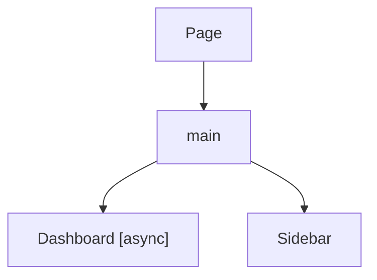

# Canopy

Statically analyze React component render trees and visualize them as Mermaid flowcharts.

## Usage

### As a dev dependency

```sh
pnpm add -D @makotot/canopy-cli
```

```json
{
  "scripts": {
    "analyze": "canopy app/page.tsx"
  }
}
```

```sh
pnpm analyze
```

### One-off via npx

```sh
npx @makotot/canopy-cli app/page.tsx
```

**Output:**



## Contributing

### Local development

```sh
pnpm install
pnpm build
node packages/cli/dist/cli.js <file>
```

## How it works

1. Parses the given `.tsx` / `.ts` file with the TypeScript compiler
2. Walks the JSX render tree recursively, following component imports
3. Annotates async components (`async function`)
4. Outputs a Mermaid `flowchart TD` diagram to stdout

## Packages

| Package | Description |
|---|---|
| [`@makotot/canopy-cli`](./packages/cli) | CLI entrypoint (`canopy` command) |
| [`@makotot/canopy-core`](./packages/core) | Analyzer, pipeline, and shared types |
| [`@makotot/canopy-annotator-async`](./packages/annotator-async) | Annotates async components |
| [`@makotot/canopy-reporter-mermaid`](./packages/reporter-mermaid) | Renders Mermaid flowchart output |

## Requirements

- Node.js 22+

## License

MIT
