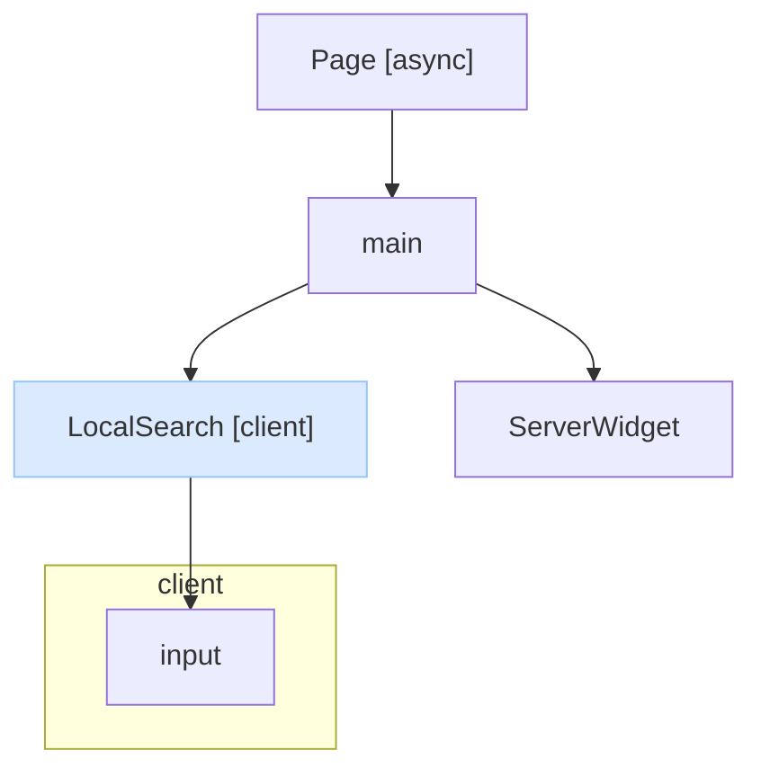

# Canopy

Statically analyze React component render trees and visualize them as Mermaid flowcharts.

## Usage

### As a dev dependency

```sh
pnpm add -D @makotot/canopy-cli
```

```json
{
  "scripts": {
    "analyze": "canopy app/page.tsx --annotator async --annotator client-boundary"
  }
}
```

```sh
pnpm analyze
```

### One-off via npx

```sh
npx @makotot/canopy-cli app/page.tsx --annotator async --annotator client-boundary
```

**Output:**



### Annotators

Annotators are opt-in via `--annotator`. Multiple flags can be combined.

| Flag | Description |
|---|---|
| `--annotator async` | Marks `async` server components with `[async]` |
| `--annotator client-boundary` | Marks RSC client boundary components with `[client]` and groups their subtree |

### Options

```
--component <name>   Analyze a named export instead of the default export
--annotator <name>   Annotator to apply (repeatable)
```

## Contributing

### Local development

```sh
pnpm install
pnpm build
node packages/cli/dist/cli.js <file>
```

## How it works

1. Parses the given `.tsx` / `.ts` file with the TypeScript compiler
2. Walks the JSX render tree recursively, following component imports
3. Applies opt-in annotators (async, client-boundary, …)
4. Outputs a Mermaid `flowchart TD` diagram to stdout

## Packages

| Package | Description |
|---|---|
| [`@makotot/canopy-cli`](./packages/cli) | CLI entrypoint (`canopy` command) |
| [`@makotot/canopy-core`](./packages/core) | Analyzer, pipeline, and shared types |
| [`@makotot/canopy-annotator-async`](./packages/annotator-async) | Marks `async` server components |
| [`@makotot/canopy-annotator-client-boundary`](./packages/annotator-client-boundary) | Marks RSC client boundary components |
| [`@makotot/canopy-reporter-mermaid`](./packages/reporter-mermaid) | Renders Mermaid flowchart output |

## Requirements

- Node.js 24+

## License

MIT
