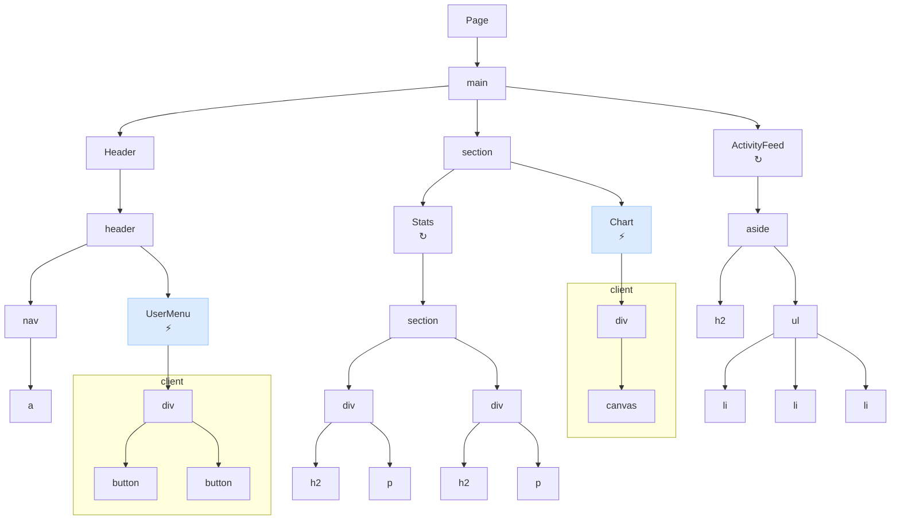

# Canopy

Statically analyze React component render trees and visualize them as Mermaid flowcharts.


## Why?

As a codebase in React app grows, its component render tree becomes hard to reason. This is increasingly true in a world where AI agents can produce large amounts of code quickly — the tree expands faster than any developer can track by reading source code.

Canopy makes the render tree visible statically:

- **Static analysis** — Works on source files directly. No build, no dev server needed.
- **Boundary visibility** — Annotators surface patterns like async components, client boundaries, Suspense, and context that are easy to miss when reading code file by file.
- **Shareable diagrams** — Outputs standard Mermaid, which renders natively in GitHub Markdown, making it easy to include in PRs or architecture docs.

## Usage

### As a dev dependency

```sh
pnpm add -D @makotot/canopy-cli
```

```json
{
  "scripts": {
    "analyze": "canopy app/page.tsx --annotator async --annotator client-boundary"
  }
}
```

```sh
pnpm analyze
```

### One-off via npx

```sh
npx @makotot/canopy-cli app/page.tsx --annotator async --annotator client-boundary
```

**Output:**



### Annotators

Annotators are opt-in via `--annotator`. Multiple flags can be combined.

| Flag                          | Icon | Description                                                   |
| ----------------------------- | ---- | ------------------------------------------------------------- |
| `--annotator async`           | ↻    | Marks `async` server components                               |
| `--annotator client-boundary` | ⚡   | Marks RSC client boundary components and groups their subtree |
| `--annotator suspense`        | ⏳   | Marks `<Suspense>` boundaries with a yellow highlight         |
| `--annotator context`         | ◎    | Marks context providers and consumers with cross-links        |
| `--annotator external`        | 📦   | Marks components from user-specified npm packages             |

The `external` annotator requires `--external-packages` to specify which packages to highlight:

```sh
canopy app/page.tsx --annotator external --external-packages "@radix-ui,lucide-react"
```

`--external-packages` accepts a comma-separated list of package names or scoped package prefixes. A prefix like `@radix-ui` matches any package under that scope (e.g. `@radix-ui/react-dialog`, `@radix-ui/react-tooltip`).

### Interactive mode

Run without arguments to launch an interactive prompt that guides you through selecting the entry point, component name, and annotators:

```sh
npx @makotot/canopy-cli --interactive
```

### Reporters

By default, output is a Mermaid flowchart. Use `--reporter` to change the format:

| Flag                 | Description                                      |
| -------------------- | ------------------------------------------------ |
| `--reporter mermaid` | Mermaid flowchart (default)                      |
| `--reporter json`    | JSON representation of the render tree           |
| `--reporter tree`    | ASCII tree printed to stdout (terminal-friendly) |

```sh
canopy app/page.tsx --reporter json
```

### Options

```
-i, --interactive           Launch interactive mode
--component <name>          Analyze a named export instead of the default export
--annotator <name>          Annotator to apply (repeatable)
--external-packages <pkgs>  Comma-separated package names for the external annotator
--reporter <name>           Reporter to use: mermaid, json, tree (default: mermaid)
```

## Contributing

### Local development

```sh
pnpm install
pnpm build
node packages/cli/dist/cli.js <file>
```

## How it works

1. Parses the given `.tsx` / `.ts` file with the TypeScript compiler
2. Walks the JSX render tree recursively, following component imports
3. Applies opt-in annotators (async, client-boundary, …)
4. Outputs a Mermaid `flowchart TD` diagram to stdout

## Packages

| Package                                                                             | Description                                       |
| ----------------------------------------------------------------------------------- | ------------------------------------------------- |
| [`@makotot/canopy-cli`](./packages/cli)                                             | CLI entrypoint (`canopy` command)                 |
| [`@makotot/canopy-core`](./packages/core)                                           | Analyzer, pipeline, and shared types              |
| [`@makotot/canopy-annotator-async`](./packages/annotator-async)                     | Marks `async` server components                   |
| [`@makotot/canopy-annotator-client-boundary`](./packages/annotator-client-boundary) | Marks RSC client boundary components              |
| [`@makotot/canopy-annotator-suspense`](./packages/annotator-suspense)               | Marks React Suspense boundaries                   |
| [`@makotot/canopy-annotator-context`](./packages/annotator-context)                 | Marks React Context providers and consumers       |
| [`@makotot/canopy-annotator-external`](./packages/annotator-external)               | Marks components from user-specified npm packages |
| [`@makotot/canopy-reporter-mermaid`](./packages/reporter-mermaid)                   | Renders Mermaid flowchart output                  |
| [`@makotot/canopy-reporter-json`](./packages/reporter-json)                         | Renders JSON output                               |
| [`@makotot/canopy-reporter-tree`](./packages/reporter-tree)                         | Renders ASCII tree output                         |

## Requirements

- Node.js 24+

## License

MIT
