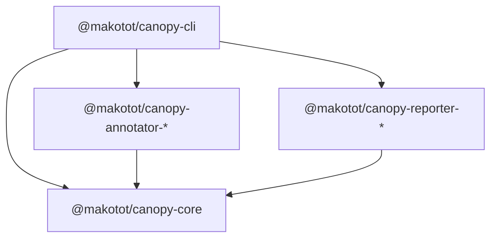
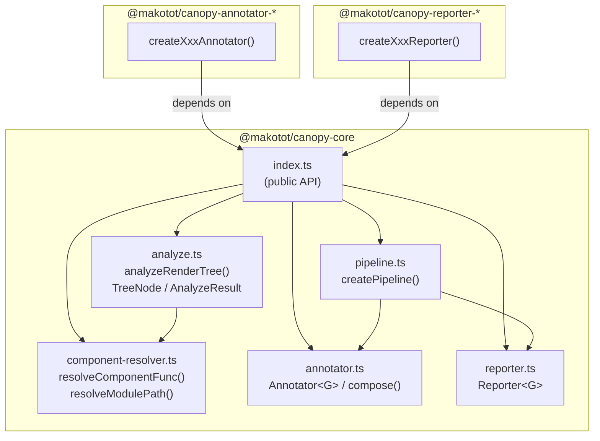

# @makotot/canopy-core Design

- **Date**: 2026-03-10

## Overview

`@makotot/canopy-core` is the foundation of the Canopy pipeline. It provides:

- The core types that define the pipeline contract (`Annotator<G>`, `Reporter<G>`)
- `analyzeRenderTree()` — the function that statically analyzes a React component file and returns a `TreeNode` tree
- `createPipeline()` — wires a build step, annotators, and a reporter together
- Internal utilities for resolving component function nodes via the TypeScript AST

All other packages (`annotator-*`, `reporter-*`, `cli`) depend on this package.

---

## Package Dependencies



## Internal Module Structure of core



---

## Key Types

### `TreeNode`

The data structure produced by `analyzeRenderTree()` and consumed by annotators and reporters.

```ts
interface TreeNode {
  component: string;
  meta?: Record<string, unknown>; // annotators write here (e.g. badges)
  condition?: 'ternary' | 'logical'; // conditional rendering
  branch?: 'consequent' | 'alternate'; // ternary branch
  renderProp?: boolean; // passed via JSX prop
  props?: Record<string, TreeNode[]>; // JSX props that contain JSX (e.g. fallback=)
  children: TreeNode[];
}
```

### `Annotator<G>`

```ts
type Annotator<G> = (graph: G) => G;
```

A pure function that takes a graph and returns an annotated copy. Multiple annotators are composed with `compose()`.

Each annotator package exports a factory function that takes runtime context (source file path, ts-morph `Project`, CLI args) and returns an `Annotator<G>`. The factory pattern keeps the type simple while allowing annotators to close over the context they need.

```ts
// annotator package pattern
export function createAsyncAnnotator(sourceFilePath: string, project: Project): Annotator<TreeNode>;
```

### `Reporter<G>`

```ts
type Reporter<G> = (graph: G) => void;
```

A function that consumes the final annotated graph and produces output (stdout, file, etc.).

---

## `analyzeRenderTree(filePath)`

### Input

An absolute or relative path to a `.tsx` / `.ts` file containing a default-exported function component.

### Output

```ts
interface AnalyzeResult {
  tree: TreeNode;
  project: Project; // ts-morph Project (passed to annotator factories)
  sourceFilePath: string; // resolved absolute path
}
```

### Processing Steps

1. Resolve the absolute path; throw `Error('File not found: ...')` if missing
2. Create a ts-morph `Project` with `jsx: JsxEmit.ReactJSX`
3. Locate the default-exported function node via `getDefaultExportedFunction()`
4. Extract shallow JSX children from the function body (`extractJsxFromFunc`)
5. Recursively expand each child via `expandNode()`:
   - HTML elements (lowercase): expand their JSX children only
   - React components (uppercase): resolve the function node via `resolveComponentFunc()`, then expand its internal JSX
   - Cycle guard: track visited nodes with a `Set<string>` keyed by `filePath::ComponentName`
   - If a component receives JSX `children`, use the passed children instead of the internal render

---

## `createPipeline(options)`

```ts
function createPipeline<G>(options: {
  build: () => G;
  annotators: Annotator<G>[];
  reporter: Reporter<G>;
}): void;
```

Executes the pipeline in order: build → compose annotators → report.

---

## `component-resolver.ts`

Exported from `index.ts` as part of the public API.

Used by `analyze.ts` internally during tree expansion, and also by annotator packages that need to inspect the AST of individual components. Not all annotators need this — `suspense` for example works purely on `TreeNode` — but annotators with complex requirements (e.g. import graph traversal in `client-boundary`, custom hook recursion in `context`) cannot avoid AST access. Exposing `component-resolver.ts` as a public API is the pragmatic boundary: annotators depend on core, and use its resolver utilities alongside the ts-morph `Project` instance provided by `AnalyzeResult`.

| Function                                                 | Description                                                                                                                           |
| -------------------------------------------------------- | ------------------------------------------------------------------------------------------------------------------------------------- |
| `resolveModulePath(specifier, fromFile)`                 | Resolves a relative or `@`-aliased import specifier to an absolute file path. Reads `tsconfig.json` paths for alias resolution.       |
| `getDefaultExportedFunction(sourceFile)`                 | Returns the AST node of the default-exported function (declaration, expression, or arrow function).                                   |
| `getNamedExportedFunction(sourceFile, name)`             | Returns the AST node of a named-exported function.                                                                                    |
| `resolveComponentFunc(tagName, sourceFilePath, project)` | Combines the above: given a JSX tag name and the file using it, returns the function node — searching imports and local declarations. |
