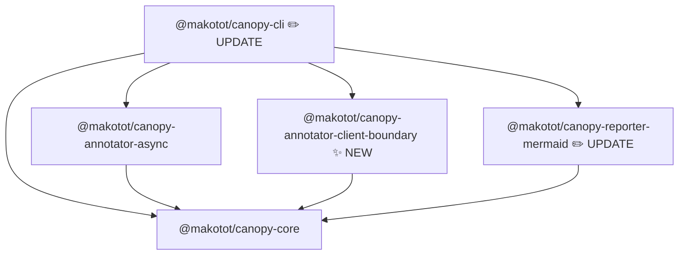

# @makotot/canopy-annotator-client-boundary Design

- **Date**: 2026-03-14

## Overview

`@makotot/canopy-annotator-client-boundary` marks `TreeNode` instances whose resolved component source file is within a "client module" — meaning the file itself declares `"use client"` at the top, or it is transitively imported by such a file.

In React Server Components (RSC), placing `"use client"` at the top of a file creates a client boundary. That file and everything it imports becomes part of the client bundle. This annotator makes those boundaries visible in the Mermaid render tree output.

The package follows the same factory function pattern as `@makotot/canopy-annotator-async`.

---

## Mermaid Output Image

Given this component tree:

```tsx
// page.tsx (Server Component)
import ClientWidget from './client-widget'; // "use client"
import ServerWidget from './server-widget'; // no directive

export default function Page() {
  return (
    <main>
      <ClientWidget />
      <ServerWidget />
    </main>
  );
}
```

Expected Mermaid output (requires corresponding `reporter-mermaid` update):

```
flowchart TD
  n0@{ shape: rect, label: "Page" }
  n1@{ shape: rounded, label: "main" }
  n2@{ shape: rect, label: "ClientWidget [client]" }
  subgraph sg3 ["client"]
    n4@{ shape: rounded, label: "button" }
  end
  n5@{ shape: rect, label: "ServerWidget" }
  n0 --- n1
  n1 --- n2
  n2 --- n4
  n1 --- n5
  style n2 fill:#dbeafe,stroke:#93c5fd
```

The key rendering behaviors driven by `meta.client`:

- The boundary component itself (`ClientWidget`) gets a blue style (`fill:#dbeafe,stroke:#93c5fd`) and a `[client]` label badge.
- Its subtree is grouped inside a `subgraph` labeled `"client"`.
- Components already inside a client `subgraph` are not re-wrapped (no nested subgraphs).
- Server components (`ServerWidget`) are rendered without any color or badge.

---

## Module Structure (TO-BE)



Packages affected:

| Package | Change |
|---|---|
| `annotator-client-boundary` | **New** — traverses import graph and sets `meta.client: true` on client module components |
| `reporter-mermaid` | **Update** — renders `meta.client` as `subgraph` grouping with blue `style` directive |
| `cli` | **Update** — `--annotator` opt-in flag to load annotators |

---

## CLI Integration

Annotators are **opt-in**. The `--annotator` option can be specified multiple times to compose annotators.

```sh
# client-boundary only
canopy src/app/page.tsx --annotator client-boundary

# combined with async
canopy src/app/page.tsx --annotator async --annotator client-boundary
```

When `--annotator` is not specified, no annotators run. This also removes the current implicit always-on behavior of `async`.

### `cli.ts` change

```ts
cli
  .command('<file>', 'Analyze a React component file and output a Mermaid flowchart')
  .option('--component <name>', 'Name of the exported component to analyze')
  .option('--annotator <name>', 'Annotator to apply (repeatable)', { type: [] })
  .action((file, options: { component?: string; annotator?: string[] }) => {
    run(file, console.log, undefined, options.component, options.annotator ?? []);
  });
```

### `run.ts` change

```ts
const ANNOTATORS: Record<string, (sourceFilePath: string, project: Project) => Annotator<TreeNode>> = {
  async: createAsyncAnnotator,
  'client-boundary': createClientBoundaryAnnotator,
};

export function run(
  filePath: string,
  out: Out,
  project?: Project,
  componentName?: string,
  annotatorNames: string[] = [],
): void {
  const { tree, project: resolvedProject, sourceFilePath } = analyzeRenderTree({ ... });
  createPipeline({
    build: () => tree,
    annotators: annotatorNames.map((name) => ANNOTATORS[name](sourceFilePath, resolvedProject)),
    reporter: createMermaidReporter(out),
  });
}
```

---

## Public API

```ts
export function createClientBoundaryAnnotator(
  sourceFilePath: string,
  project: Project,
): Annotator<TreeNode>
```

- `sourceFilePath` — absolute path to the entry file passed to `analyzeRenderTree`. Used as the root from which import discovery starts.
- `project` — the shared ts-morph `Project` instance. The annotator reads source files from it, and lazily adds files not yet loaded via `project.addSourceFileAtPath`.

---

## Meta Schema

A node is annotated when its component resolves to a source file that is a client module.

```ts
meta: {
  client: true  // present only when the component is in the client graph
}
```

The field is absent (not `false`) when the component is not a client component — sparse meta objects are the convention throughout the codebase (mirrors `meta.async: true` in `annotator-async`).

---

## Algorithm: `buildClientModuleSet`

### Phase 1 — Import Graph Construction

Starting from `rootFilePath`, recursively walk import declarations to build a complete import graph:

```
importGraph: Map<absoluteFilePath, Set<absoluteFilePath>>
```

For each source file:

1. Iterate `sf.getImportDeclarations()`.
2. Keep only specifiers starting with `"."` (relative) — skip bare `node_modules` specifiers like `"react"`.
3. Call `resolveModulePath(specifier, currentFilePath)` (from `@makotot/canopy-core`) to get the absolute path.
4. Retrieve or add the target `SourceFile` via `project.getSourceFile(resolved) ?? project.addSourceFileAtPath(resolved)`.
5. Record the edge and recurse into the target (skip if already discovered).

### Phase 2 — Client Module Propagation

Walk the discovered file set. For each file that has a `"use client"` directive as its first statement, mark it and all files it imports (transitively) as client modules:

```
clientModules: Set<absoluteFilePath>
```

`hasUseClientDirective` checks:

1. `sf.getStatements()[0]` exists.
2. It is an `ExpressionStatement`.
3. Its expression is a `StringLiteral` with value `"use client"`.

### Tree Walk

After building `clientModules`, walk the `TreeNode` tree recursively:

1. Call `resolveComponent(node.component, sourceFilePath, project)` (from `@makotot/canopy-core`).
2. If found, get `fn.getSourceFile().getFilePath()`.
3. If that path is in `clientModules`, spread `meta: { ...node.meta, client: true }` onto the returned node.
4. Recurse into `node.children` and `node.props` values.

`buildClientModuleSet` is called once inside the returned annotator function closure and its result is passed as a parameter to `annotateNode` — not recomputed on every recursive call.

---

## Fixture File Plan

All fixtures live under `src/__fixtures__/`.

| File | Purpose |
|---|---|
| `page-with-client-and-server.tsx` | Entry; renders `ClientWidget` and `ServerWidget` side-by-side. Primary fixture for the direct boundary case. |
| `client-widget.tsx` | Has `"use client"` at top. Direct client boundary. |
| `server-widget.tsx` | No directive. Should not be annotated. |
| `page-with-transitive-client.tsx` | Entry; renders `ClientImportsShared` which in turn renders `SharedUtil`. Demonstrates transitive propagation. |
| `client-imports-shared.tsx` | Has `"use client"` and imports `SharedUtil`. |
| `shared-util.tsx` | No directive; pulled into the client graph transitively via `client-imports-shared.tsx`. |

---

## Test Case Plan

```ts
it.each([
  {
    label: 'marks direct client component with meta.client: true',
    fixture: 'page-with-client-and-server.tsx',
    get: (tree) => /* find ClientWidget */ ...,
    expected: true,
  },
  {
    label: 'does not mark server component',
    fixture: 'page-with-client-and-server.tsx',
    get: (tree) => /* find ServerWidget */ ...,
    expected: undefined,
  },
  {
    label: 'does not mark html elements',
    fixture: 'page-with-client-and-server.tsx',
    get: (tree) => tree.children[0]?.meta?.['client'],
    expected: undefined,
  },
  {
    label: 'marks transitively-imported component as client',
    fixture: 'page-with-transitive-client.tsx',
    get: (tree) => /* find SharedUtil */ ...,
    expected: true,
  },
])('$label', ...)
```

---

## File Structure

```
packages/annotator-client-boundary/
  src/
    index.ts                             # exports createClientBoundaryAnnotator
    index.test.ts
    __fixtures__/
      page-with-client-and-server.tsx
      client-widget.tsx
      server-widget.tsx
      page-with-transitive-client.tsx
      client-imports-shared.tsx
      shared-util.tsx
  package.json
  tsconfig.json
  tsconfig.build.json
```

`src/index.ts` symbol order (exports first per TypeScript rules):

```
1. export function createClientBoundaryAnnotator(...)   ← public API
2. function annotateNode(...)                            ← recursive tree walk
3. function buildClientModuleSet(...)                    ← two-phase algorithm, internal
4. function hasUseClientDirective(...)                   ← pure predicate, internal
```
