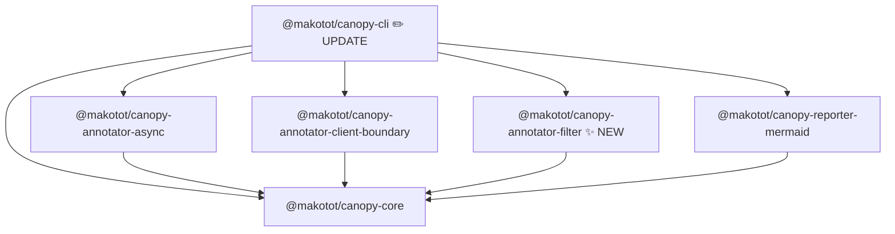

# @makotot/canopy-annotator-filter Design

- **Date**: 2026-03-16

## Overview

`@makotot/canopy-annotator-filter` removes unwanted nodes from a `TreeNode` tree before rendering. In real-world applications the render tree can span hundreds of nodes. Depending on the investigation context, some nodes are noise — UI library primitives, layout wrappers, analytics instrumentation components, etc. This annotator lets users exclude them by glob pattern so the output stays focused on what matters.

The package follows the same factory function pattern as `@makotot/canopy-annotator-async`.

---

## CLI Integration

Exclusion is opt-in via `--exclude`. The flag is repeatable.

```sh
# exclude a single component
canopy src/App.tsx --exclude Button

# exclude multiple components
canopy src/App.tsx --exclude ErrorBoundary --exclude Analytics --exclude Footer

# glob patterns (prefix / suffix)
canopy src/App.tsx --exclude "Layout.*" --exclude "*.Provider"
```

### Behavior

Excluded nodes are **completely removed** from the tree — neither the node itself nor any of its descendants appear in the output.

Given this tree:

```tsx
export default function App() {
  return (
    <Layout>
      <Analytics />
      <UserProfile />
    </Layout>
  );
}
```

Running `canopy src/App.tsx --exclude Analytics` produces:

```
flowchart TD
  n0["App"]
  n1["Layout"]
  n2["UserProfile"]
  n0 --> n1
  n1 --> n2
```

`Analytics` is gone entirely — no node definition, no edge.

---

## Module Structure (TO-BE)



Packages affected:

| Package            | Change                                                             |
| ------------------ | ------------------------------------------------------------------ |
| `annotator-filter` | **New** — removes excluded nodes from the tree using glob matching |
| `cli`              | **Update** — `--exclude` flag wired to `createFilterAnnotator`     |

Reporter and core are unchanged — the reporter simply receives a smaller tree and renders it as normal.

---

## Public API

```ts
export interface FilterOptions {
  exclude?: string[]; // glob patterns matched against node.component
}

export function createFilterAnnotator(options: FilterOptions): Annotator<TreeNode>;
```

- `options.exclude` — list of glob patterns. A node whose `component` value matches any pattern is removed along with all its descendants.
- Returns an `Annotator<TreeNode>` compatible with `compose()` from `@makotot/canopy-core`.
- No `sourceFilePath` or `project` parameter needed — filtering is purely name-based.

---

## Algorithm

### Pattern Matching

Uses `minimatch` for glob matching against `node.component`.

```ts
import { minimatch } from 'minimatch';

function isExcluded(component: string, patterns: string[]): boolean {
  return patterns.some((pattern) => minimatch(component, pattern));
}
```

### Tree Walk

```ts
function filterNode(node: TreeNode, patterns: string[]): TreeNode {
  return {
    ...node,
    children: node.children
      .filter((child) => !isExcluded(child.component, patterns))
      .map((child) => filterNode(child, patterns)),
    props: Object.fromEntries(
      Object.entries(node.props ?? {}).map(([key, nodes]) => [
        key,
        nodes.filter((n) => !isExcluded(n.component, patterns)).map((n) => filterNode(n, patterns)),
      ]),
    ),
  };
}
```

- Pure function — no mutation.
- Filters both `children` and `props` (render props / slot props) at every level.
- Composable with other annotators via `compose()`.

### CLI Wiring

`createFilterAnnotator` is registered in the CLI annotator registry alongside the existing annotators. Unlike `async` and `client-boundary`, it does not require `sourceFilePath` or `project`, so the registry entry is a thin wrapper.

```ts
// packages/cli/src/annotators.ts (schematic)
'filter': (_sourceFilePath, _project, options) =>
  createFilterAnnotator({ exclude: options.exclude }),
```

The `--exclude` values collected by the CLI are passed through as `options.exclude`.

---

## Fixture File Plan

All fixtures live under `src/__fixtures__/`.

| File                 | Purpose                                                 |
| -------------------- | ------------------------------------------------------- |
| `app-with-noise.tsx` | Entry; renders `Analytics`, `Footer`, and `UserProfile` |
| `user-profile.tsx`   | Business component with child `Avatar` and `Button`     |

---

## Test Case Plan

```ts
it.each([
  {
    label: 'removes a directly excluded component',
    fixture: 'app-with-noise.tsx',
    exclude: ['Analytics'],
    check: (tree) => /* no node with component === 'Analytics' */ ...,
  },
  {
    label: 'removes descendants of an excluded node',
    fixture: 'app-with-noise.tsx',
    exclude: ['UserProfile'],
    check: (tree) => /* Avatar and Button also absent */ ...,
  },
  {
    label: 'matches glob suffix pattern',
    fixture: 'app-with-noise.tsx',
    exclude: ['*.Provider'],
    check: (tree) => /* any *.Provider nodes gone */ ...,
  },
  {
    label: 'leaves non-matching nodes intact',
    fixture: 'app-with-noise.tsx',
    exclude: ['Analytics'],
    check: (tree) => /* UserProfile still present */ ...,
  },
  {
    label: 'no-op when exclude list is empty',
    fixture: 'app-with-noise.tsx',
    exclude: [],
    check: (tree) => /* tree unchanged */ ...,
  },
])('$label', ...)
```

---

## File Structure

```
packages/annotator-filter/
  src/
    index.ts          # exports createFilterAnnotator
    index.test.ts
    __fixtures__/
      app-with-noise.tsx
      user-profile.tsx
  package.json
  tsconfig.json
  tsconfig.build.json
```

`src/index.ts` symbol order:

```
1. export function createFilterAnnotator(...)   ← public API
2. function filterNode(...)                     ← recursive tree walk, internal
3. function isExcluded(...)                     ← pure predicate, internal
```
