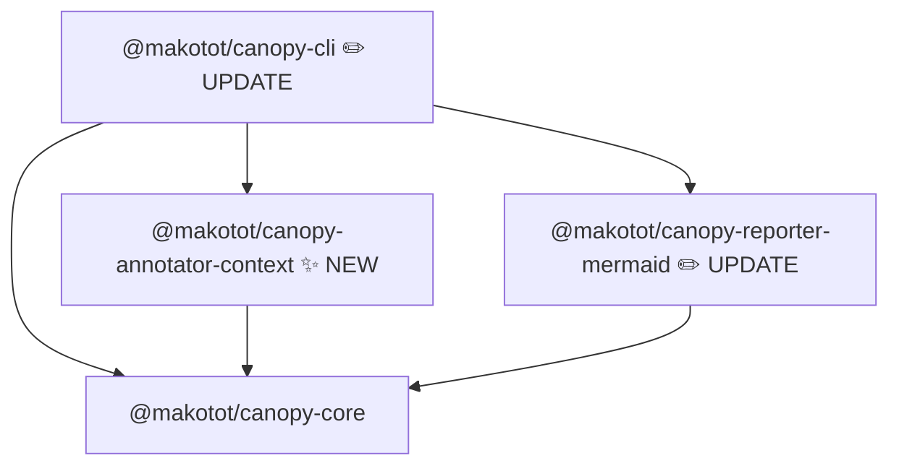

# Design: `@makotot/canopy-annotator-context`

- **Date**: 2026-03-18

## Overview

`@makotot/canopy-annotator-context` detects React Context usage in the render tree and annotates each `TreeNode` with information about which contexts the component provides or consumes.

The annotator handles both explicit patterns (`<XxxContext.Provider>`, `useContext()`) and the more common case where context consumption is wrapped in a custom hook (`useAuth()`, `useTheme()`, etc.) that internally calls `useContext`. Custom hooks are resolved recursively via the TypeScript AST.

Provider and consumer nodes of the same context are visually connected by dashed cross-edges in the Mermaid output. The annotator itself determines which provider–consumer pairs to connect (scope-aware, nearest-ancestor logic), and communicates the result to the reporter via `meta.linkId` and `meta.crossLinks`.

---

## Detection Targets

| Pattern                                             | Description                                               |
| --------------------------------------------------- | --------------------------------------------------------- |
| `<XxxContext.Provider>` in JSX                      | Direct Provider element in the render output              |
| Wrapper component rendering `<XxxContext.Provider>` | e.g. `AuthProvider` that returns `<AuthContext.Provider>` |
| `<XxxContext.Consumer>` in JSX                      | Render prop pattern                                       |
| `useContext(SomeContext)`                           | Direct hook call                                          |
| `use(SomeContext)`                                  | Standard hook call                                        |
| `useXxx()` → `useContext(SomeContext)`              | Custom hook wrapping useContext (recursive)               |

---

## Mermaid Output Image

Given this component tree:

```tsx
// page.tsx
import { AuthProvider } from './auth-context';
import { UserMenu } from './user-menu';

export default function Page() {
  return (
    <AuthProvider>
      <UserMenu />
    </AuthProvider>
  );
}
```

```tsx
// auth-context.tsx
export const AuthContext = createContext<AuthContextValue>({ ... });

export function AuthProvider({ children }: { children: React.ReactNode }) {
  return (
    <AuthContext.Provider value={{ user, signOut }}>
      {children}
    </AuthContext.Provider>
  );
}

export function useAuth() {
  return useContext(AuthContext);
}
```

```tsx
// user-menu.tsx
import { useAuth } from './auth-context';

export function UserMenu() {
  const { user } = useAuth();
  return <nav>{user.name}</nav>;
}
```

Expected Mermaid output:

```
flowchart TD
  n0["Page"]
  n1["AuthProvider [provides:AuthContext]"]
  n2["UserMenu [consumes:AuthContext]"]
  n0 --> n1
  n1 --> n2
  n1 -.->|AuthContext| n2
  style n1 fill:#d1fae5,stroke:#6ee7b7
  style n2 fill:#ede9fe,stroke:#c4b5fd
```

Key rendering behaviors:

- Provider nodes get a green style and a `provides:ContextName` badge.
- Consumer nodes get a purple style and a `consumes:ContextName` badge.
- `reporter-mermaid` emits a dashed cross-edge (`-.->`) from each provider to each of its nearest-descendant consumers, labeled with the context name.
- The cross-edge is drawn in addition to the existing tree edges.
- When a component provides multiple contexts or consumes multiple contexts, one entry per context exists in `meta.crossLinks` / `meta.linkId`.

---

## Module Structure



Packages affected:

| Package             | Change                                                                                                             |
| ------------------- | ------------------------------------------------------------------------------------------------------------------ |
| `annotator-context` | **New** — detects Context providers/consumers; writes `meta.badge`, `meta.style`, `meta.linkId`, `meta.crossLinks` |
| `reporter-mermaid`  | **Update** — renders `meta.crossLinks` as dashed edges using `meta.linkId` to resolve targets                      |
| `cli`               | **Update** — register `context` in the annotator registry                                                          |

---

## Meta Convention Extension

Two new render convention fields are added alongside the existing `meta.badge`, `meta.group`, and `meta.style`.

### `meta.linkId`

**Type**: `string`
**Purpose**: A stable identifier assigned to this node by the annotator so that other nodes can reference it in `meta.crossLinks`. The reporter maps `linkId` to the Mermaid node ID it assigns during tree walk.

```ts
// Consumer node sets:
meta: {
  linkId: 'ctx-abc123',
}
```

### `meta.crossLinks`

**Type**: `Array<{ targetId: string; label: string }>`
**Purpose**: Declares directed cross-edges from this node to the target nodes identified by `targetId`. The reporter emits a dashed edge for each entry.

```ts
// Provider node sets:
meta: {
  crossLinks: [{ targetId: 'ctx-abc123', label: 'AuthContext' }],
}
```

`reporter-mermaid` rendering:

1. During tree walk, build a `Map<linkId, mermaidNodeId>`.
2. After emitting all tree edges, iterate every node's `meta.crossLinks` and emit `sourceMermaidId -.->|label| targetMermaidId`.

The reporter has no knowledge of "context" — it only follows the `linkId` → `crossLinks` indirection.

### Updated convention table

| Field             | Type                                         | Purpose                                      |
| ----------------- | -------------------------------------------- | -------------------------------------------- |
| `meta.badge`      | `string`                                     | Short label appended to the component name   |
| `meta.group`      | `string`                                     | Groups the subtree into a labeled `subgraph` |
| `meta.style`      | `{ fill: string; stroke: string }`           | Background/border color                      |
| `meta.linkId`     | `string`                                     | Stable node reference target for cross-edges |
| `meta.crossLinks` | `Array<{ targetId: string; label: string }>` | Cross-edges from this node to target nodes   |

---

## CLI Integration

```sh
canopy src/app/page.tsx --annotator context
canopy src/app/page.tsx --annotator async --annotator context
```

CLI annotator registry addition:

```ts
// packages/cli/src/annotators.ts
import { createContextAnnotator } from '@makotot/canopy-annotator-context';

'context': createContextAnnotator,
```

---

## Public API

```ts
export function createContextAnnotator(
  sourceFilePath: string,
  project: Project,
): Annotator<TreeNode>;
```

- `sourceFilePath` — absolute path to the entry file. Used as the starting point for component and hook resolution.
- `project` — the shared ts-morph `Project` instance. Source files are loaded lazily via `project.addSourceFileAtPath` as imports are traversed.

---

## Meta Schema

```ts
meta: {
  // Render convention fields (read by reporter-mermaid)
  badge: string;    // e.g. "provides:AuthContext" or "consumes:AuthContext"
  style: { fill: string; stroke: string };
  linkId?: string;  // set on consumer nodes
  crossLinks?: Array<{ targetId: string; label: string }>;  // set on provider nodes

  // Annotator-specific fields (for programmatic consumers)
  contextBadges: string[];  // e.g. ["provides:AuthContext", "consumes:ThemeContext"]
}
```

### Badge and style assignment

| Situation             | `badge`                                  | `style`              |
| --------------------- | ---------------------------------------- | -------------------- |
| Provides only         | `"provides:AuthContext"`                 | green                |
| Consumes only         | `"consumes:AuthContext"`                 | purple               |
| Provides and consumes | `"provides:AuthContext"` (provides wins) | green                |
| Multiple contexts     | first entry from `contextBadges`         | based on first entry |

Colors:

```ts
const PROVIDER_STYLE = { fill: '#d1fae5', stroke: '#6ee7b7' }; // green-100 / green-300
const CONSUMER_STYLE = { fill: '#ede9fe', stroke: '#c4b5fd' }; // violet-100 / violet-300
```

Fields are absent when no context is detected (sparse meta convention, consistent with other annotators).

---

## Algorithm

### Overview

The annotator runs in two passes over the tree:

1. **Annotation pass** — walk the tree, resolve context info per node, assign `meta.linkId` to consumers, collect `contextBadges`.
2. **Cross-link pass** — walk the annotated tree again with a provider stack; for each consumer, find the nearest ancestor provider and append to that provider's `meta.crossLinks`.

### Pass 1 — Per-node annotation

For each `TreeNode`:

**JSX-level detection** (from `node.component`):

- Ends with `.Provider` → add `provides:XxxContext` to `contextBadges`
- Ends with `.Consumer` → add `consumes:XxxContext` to `contextBadges`

**Component function analysis** via `resolveComponent(node.component, sourceFilePath, project)`:

- `findProvidedContexts(funcNode)` — scan `JsxOpeningElement` / `JsxSelfClosingElement` descendants for `.Provider` tags
- `findConsumedContexts(funcNode, funcSourceFilePath, project, visited, hookCache)`:
  - `useContext(X)` / `React.useContext(X)` → add `X`
  - `use(X)` / `React.use(X)` where `X` contains `"Context"` → add `X`
  - `useXxx()` → resolve hook and recurse

For each detected consume, assign `meta.linkId` (generated ID, e.g. `ctx-<counter>`).

### Pass 2 — Nearest-ancestor cross-link resolution

Walk the annotated tree depth-first, maintaining a provider stack per context name:

```
providerStack: Map<contextName, TreeNode[]>
```

On entering a node:

- For each `provides:X` in `meta.contextBadges`: push this node onto `providerStack[X]`
- For each `consumes:X` in `meta.contextBadges`:
  - Look up `providerStack[X]`, take the top entry
  - If found, append `{ targetId: node.meta.linkId, label: X }` to that provider's `meta.crossLinks`

On leaving a node:

- For each `provides:X` in `meta.contextBadges`: pop from `providerStack[X]`

This correctly handles nested providers of the same context — each consumer connects only to the innermost enclosing provider.

### Custom hook resolution

`resolveHookFunc(hookName, sourceFilePath, project)`:

1. Search same-file function declarations and variable declarations (arrow functions).
2. Search named imports whose specifier starts with `"."` or `"@/"` (local imports only; `node_modules` hooks are excluded to bound the traversal).
3. Return the function node if found; `undefined` otherwise.

### Hook result caching

A `hookCache: Map<string, string[]>` is created inside the `createContextAnnotator` closure. Before resolving a hook, check the cache; write back after resolution. This prevents redundant AST traversal when multiple components call the same custom hook.

### Cycle prevention

A `visited: Set<Node>` is passed through `findConsumedContexts` to prevent infinite recursion when hooks reference each other.

---

## `reporter-mermaid` Update

### `meta.linkId` mapping

During tree walk, when a node has `meta.linkId`, record: `linkIdMap.set(meta.linkId, currentMermaidNodeId)`.

### Cross-edge emission

After emitting all node declarations and tree edges:

```ts
for (const [mermaidId, node] of nodeEntries) {
  for (const { targetId, label } of (node.meta?.crossLinks ?? []) as CrossLink[]) {
    const targetMermaidId = linkIdMap.get(targetId);
    if (targetMermaidId) {
      lines.push(`  ${mermaidId} -.->|${label}| ${targetMermaidId}`);
    }
  }
}
```

The reporter has no awareness of "context" — it only follows the `linkId` reference.

---

## Fixture File Plan

All fixtures live under `src/__fixtures__/`.

| File                                  | Purpose                                                                |
| ------------------------------------- | ---------------------------------------------------------------------- |
| `page-with-direct-provider.tsx`       | Entry; renders `<AuthContext.Provider>` directly in JSX                |
| `page-with-wrapper-provider.tsx`      | Entry; renders `AuthProvider` (wraps Provider internally)              |
| `page-with-direct-consumer.tsx`       | Component calls `useContext(AuthContext)` directly                     |
| `page-with-use-consumer.tsx`          | Component calls `use(AuthContext)`                                     |
| `page-with-custom-hook-consumer.tsx`  | Component calls `useAuth()` which calls `useContext`                   |
| `page-with-consumer-render-prop.tsx`  | Component uses `<AuthContext.Consumer>` render prop                    |
| `page-with-provider-and-consumer.tsx` | Component that both provides and consumes different contexts           |
| `page-with-nested-providers.tsx`      | Two nested providers of the same context; consumers connect to nearest |
| `auth-context.tsx`                    | Shared: `AuthContext`, `AuthProvider`, `useAuth` definitions           |

---

## Test Case Plan

```ts
it.each([
  {
    label: 'annotates direct <XxxContext.Provider> in JSX',
    fixture: 'page-with-direct-provider',
    get: (tree) => findNode(tree, 'AuthContext.Provider')?.meta?.contextBadges,
    expected: ['provides:AuthContext'],
  },
  {
    label: 'annotates wrapper component that renders Provider internally',
    fixture: 'page-with-wrapper-provider',
    get: (tree) => findNode(tree, 'AuthProvider')?.meta?.contextBadges,
    expected: ['provides:AuthContext'],
  },
  {
    label: 'annotates component with direct useContext call',
    fixture: 'page-with-direct-consumer',
    get: (tree) => findNode(tree, 'UserMenu')?.meta?.contextBadges,
    expected: ['consumes:AuthContext'],
  },
  {
    label: 'annotates component with use() call',
    fixture: 'page-with-use-consumer',
    get: (tree) => findNode(tree, 'ProfileBadge')?.meta?.contextBadges,
    expected: ['consumes:AuthContext'],
  },
  {
    label: 'annotates component consuming context via custom hook',
    fixture: 'page-with-custom-hook-consumer',
    get: (tree) => findNode(tree, 'SignOutButton')?.meta?.contextBadges,
    expected: ['consumes:AuthContext'],
  },
  {
    label: 'annotates <XxxContext.Consumer> render prop usage',
    fixture: 'page-with-consumer-render-prop',
    get: (tree) => findNode(tree, 'AuthContext.Consumer')?.meta?.contextBadges,
    expected: ['consumes:AuthContext'],
  },
  {
    label: 'sets crossLinks on provider pointing to nearest consumer',
    fixture: 'page-with-direct-provider',
    get: (tree) => {
      const consumer = findNode(tree, 'UserMenu');
      const provider = findNode(tree, 'AuthContext.Provider');
      return provider?.meta?.crossLinks?.[0]?.targetId === consumer?.meta?.linkId;
    },
    expected: true,
  },
  {
    label: 'nested providers: consumer connects to nearest ancestor',
    fixture: 'page-with-nested-providers',
    get: (tree) => {
      const inner = findNode(tree, 'AuthProvider', { depth: 'inner' });
      const consumer = findNode(tree, 'UserMenu');
      return inner?.meta?.crossLinks?.[0]?.targetId === consumer?.meta?.linkId;
    },
    expected: true,
  },
  {
    label: 'does not annotate components with no context usage',
    fixture: 'page-with-direct-provider',
    get: (tree) => findNode(tree, 'main')?.meta?.contextBadges,
    expected: undefined,
  },
])('$label', ...)
```

---

## File Structure

```
packages/annotator-context/
  src/
    index.ts         # exports createContextAnnotator
    index.test.ts
    __fixtures__/
      page-with-direct-provider.tsx
      page-with-wrapper-provider.tsx
      page-with-direct-consumer.tsx
      page-with-use-consumer.tsx
      page-with-custom-hook-consumer.tsx
      page-with-consumer-render-prop.tsx
      page-with-provider-and-consumer.tsx
      page-with-nested-providers.tsx
      auth-context.tsx
  package.json
  tsconfig.json
  tsconfig.build.json
```

`src/index.ts` symbol order:

```
1. export function createContextAnnotator(...)   ← public API
2. function annotateNode(...)                     ← pass 1: per-node annotation
3. function resolveCrossLinks(...)                ← pass 2: nearest-ancestor cross-link
4. function findProvidedContexts(...)             ← JSX Provider scan
5. function findConsumedContexts(...)             ← useContext / custom hook scan
6. function resolveHookFunc(...)                  ← hook function lookup
7. function looksLikeContext(...)                 ← heuristic for use() argument
```

---

## Open Questions

1. **`node_modules` hooks** — Currently excluded from hook resolution. If a user wraps a context inside a library hook, it won't be detected. Acceptable for v0.1.
2. **Multiple contexts badge display** — When a component provides/consumes more than one context, only the first is shown in `meta.badge`. Comma-joined alternative deferred pending real-world feedback.
3. **Cross-edge visual clutter** — If many components consume the same context, the dashed edges may crowd the diagram. To be evaluated with real fixtures before shipping.
