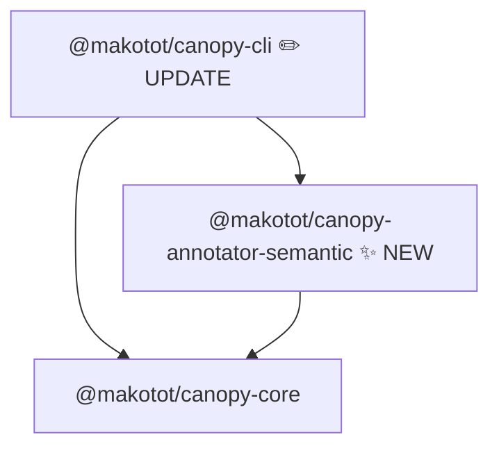

# Design: `@makotot/canopy-annotator-semantic`

- **Date**: 2026-03-19

## Overview

`@makotot/canopy-annotator-semantic` annotates HTML elements in the render tree with their ARIA role as `meta.badge`. It detects both implicit roles (derived from element name) and explicit roles (from the `role` attribute). The goal is to surface the structure that screen readers and other assistive technologies actually see — i.e., the accessibility tree — directly in the Mermaid flowchart.

The annotator does not judge whether the structure is good or bad. It only surfaces information. The user decides how to interpret it.

---

## Detection Targets

Two detection paths exist:

1. **Explicit role** — if the element has a `role` attribute, it takes precedence over the implicit role.
2. **Implicit role** — element name is matched as-is from `TreeNode.component`. For `input`, the `type` attribute is read; absent `type` defaults to `text`.

Explicit `role` always wins. Style assignment follows the resolved role: roles other than `generic`, `presentation`, and `none` get green style.

`core` supports selective attribute collection via `attrsToCollect?: string[]` in `AnalyzeOptions`. Only the declared attributes are stored in `TreeNode.attrs`. Annotators declare which attributes they need via a `requiredAttrs` export; the CLI aggregates them before calling `analyzeRenderTree`.

### Landmark & Sectioning

| Element(s) | ARIA Implicit Role | Badge           |
| ---------- | ------------------ | --------------- |
| `header`   | `banner`           | `banner`        |
| `footer`   | `contentinfo`      | `contentinfo`   |
| `main`     | `main`             | `main`          |
| `nav`      | `navigation`       | `navigation`    |
| `aside`    | `complementary`    | `complementary` |
| `article`  | `article`          | `article`       |
| `section`  | `region`           | `region`        |
| `search`   | `search`           | `search`        |
| `dialog`   | `dialog`           | `dialog`        |

### Heading

| Element(s) | ARIA Implicit Role | Badge                       |
| ---------- | ------------------ | --------------------------- |
| `h1`–`h6`  | `heading`          | `heading lv1`–`heading lv6` |

### List

| Element(s)         | ARIA Implicit Role | Badge        |
| ------------------ | ------------------ | ------------ |
| `ul`, `ol`, `menu` | `list`             | `list`       |
| `li`               | `listitem`         | `listitem`   |
| `dl`               | `list`             | `list`       |
| `dt`               | `term`             | `term`       |
| `dd`               | `definition`       | `definition` |

### Table

| Element(s)                | ARIA Implicit Role | Badge          |
| ------------------------- | ------------------ | -------------- |
| `table`                   | `table`            | `table`        |
| `caption`                 | `caption`          | `caption`      |
| `thead`, `tbody`, `tfoot` | `rowgroup`         | `rowgroup`     |
| `tr`                      | `row`              | `row`          |
| `th`                      | `columnheader`     | `columnheader` |
| `td`                      | `cell`             | `cell`         |

### Form & Interactive

| Element(s)                               | ARIA Implicit Role | Badge         |
| ---------------------------------------- | ------------------ | ------------- |
| `form`                                   | `form`             | `form`        |
| `fieldset`                               | `group`            | `group`       |
| `button`                                 | `button`           | `button`      |
| `select`                                 | `listbox`          | `listbox`     |
| `datalist`                               | `listbox`          | `listbox`     |
| `option`                                 | `option`           | `option`      |
| `optgroup`                               | `group`            | `group`       |
| `textarea`                               | `textbox`          | `textbox`     |
| `input` (type=text/email/tel/url)        | `textbox`          | `textbox`     |
| `input` (type=search)                    | `searchbox`        | `searchbox`   |
| `input` (type=number)                    | `spinbutton`       | `spinbutton`  |
| `input` (type=range)                     | `slider`           | `slider`      |
| `input` (type=checkbox)                  | `checkbox`         | `checkbox`    |
| `input` (type=radio)                     | `radio`            | `radio`       |
| `input` (type=button/submit/reset/image) | `button`           | `button`      |
| `output`                                 | `status`           | `status`      |
| `progress`                               | `progressbar`      | `progressbar` |
| `meter`                                  | `meter`            | `meter`       |
| `details`                                | `group`            | `group`       |
| `summary`                                | `button`           | `button`      |

### Navigation

| Element(s) | ARIA Implicit Role | Badge  |
| ---------- | ------------------ | ------ |
| `a`        | `link`             | `link` |
| `area`     | `link`             | `link` |

### Embedded & Media

| Element(s) | ARIA Implicit Role | Badge    |
| ---------- | ------------------ | -------- |
| `img`      | `img`              | `img`    |
| `figure`   | `figure`           | `figure` |
| `svg`      | `img`              | `img`    |

### Text-level Semantics

| Element(s)   | ARIA Implicit Role | Badge         |
| ------------ | ------------------ | ------------- |
| `p`          | `paragraph`        | `paragraph`   |
| `blockquote` | `blockquote`       | `blockquote`  |
| `hr`         | `separator`        | `separator`   |
| `strong`     | `strong`           | `strong`      |
| `em`         | `emphasis`         | `emphasis`    |
| `mark`       | `mark`             | `mark`        |
| `del`        | `deletion`         | `deletion`    |
| `ins`        | `insertion`        | `insertion`   |
| `sub`        | `subscript`        | `subscript`   |
| `sup`        | `superscript`      | `superscript` |
| `code`       | `code`             | `code`        |
| `time`       | `time`             | `time`        |
| `dfn`        | `term`             | `term`        |
| `math`       | `math`             | `math`        |

### Generic

| Element(s)    | ARIA Implicit Role | Badge     |
| ------------- | ------------------ | --------- |
| `div`, `span` | `generic`          | `generic` |

React component nodes and elements without an implicit ARIA role are not annotated.

---

## Mermaid Output Image

Given:

```tsx
export default function Page() {
  return (
    <div>
      <header>
        <nav>
          <a href="/">Home</a>
        </nav>
      </header>
      <main>
        <h1>Title</h1>
      </main>
      <footer>Footer</footer>
    </div>
  );
}
```

Expected Mermaid output:

```
flowchart TD
  n0["Page"]
  n1["div [generic]"]
  n2["header [banner]"]
  n3["nav [navigation]"]
  n4["a [link]"]
  n5["main [main]"]
  n6["h1 [heading lv1]"]
  n7["footer [contentinfo]"]
  n0 --> n1
  n1 --> n2
  n2 --> n3
  n3 --> n4
  n1 --> n5
  n5 --> n6
  n1 --> n7
  style n2 fill:#dcfce7,stroke:#86efac
  style n3 fill:#dcfce7,stroke:#86efac
  style n4 fill:#dcfce7,stroke:#86efac
  style n5 fill:#dcfce7,stroke:#86efac
  style n6 fill:#dcfce7,stroke:#86efac
  style n7 fill:#dcfce7,stroke:#86efac
```

Key rendering behaviors:

- The node label already contains the element name (e.g. `div`). The badge appends the ARIA role.
- Green style for elements with a meaningful role. `generic`, `presentation`, and `none` receive only a badge with no style override.
- React component nodes (`Page`) are not annotated and have no badge or style.

---

## Module Structure



| Package              | Change                                                                                                                                                     |
| -------------------- | ---------------------------------------------------------------------------------------------------------------------------------------------------------- |
| `core`               | **Update** — add `attrs?: Record<string, string>` to `TreeNode`; add `attrsToCollect?: string[]` to `AnalyzeOptions`                                       |
| `annotator-semantic` | **New** — declares `requiredAttrs`; reads `node.attrs.role`/`node.attrs.type`; writes `meta.badge` and `meta.style`                                        |
| `cli`                | **Update** — migrate registry entries to `{ create, requiredAttrs? }` shape; aggregate `requiredAttrs` and pass as `attrsToCollect` to `analyzeRenderTree` |

No changes to `reporter-mermaid`.

---

## Public API

```ts
export const requiredAttrs: string[] = ['role', 'type'];

export function createSemanticAnnotator(): Annotator<TreeNode>;
```

No parameters required. `role` and `type` are available in `node.attrs` when the caller passes `attrsToCollect` to `analyzeRenderTree`.

---

## Meta Schema

```ts
// set only when the element is in the detection list
meta: {
  badge: string;   // resolved ARIA role, e.g. 'banner', 'heading lv1', 'generic'
  style?: {        // absent for 'generic' and 'presentation'/'none'
    fill: string;
    stroke: string;
  }
}
```

### Style assignment

All elements with a resolved role other than `generic`, `presentation`, and `none` receive green style (`fill: #dcfce7`, `stroke: #86efac`). `generic`, `presentation`, and `none` receive a `badge` but no `style`. Fields are absent when the element is not in the detection list (sparse meta, consistent with other annotators).

---

## Algorithm

1. Walk the `TreeNode` tree recursively (children + props slots).
2. Skip nodes where `node.component` starts with an uppercase letter (React components).
3. If `node.attrs.role` is present, use it as the badge directly (explicit role).
4. Otherwise, look up `node.component` in a static map of `element → badge` (implicit role). For `input`, use `node.attrs.type` (defaults to `text` if absent); if the type value is not in the known set (e.g. `hidden`, `color`, `date`), treat the node as unmatched.
5. Resolve style: `generic`, `presentation`, `none` → no style; any other role → green style.
6. Merge `{ badge, style? }` into `node.meta` (spread, preserving existing fields).
7. Return the annotated node; unmatched or skipped nodes are returned unchanged.

No AST traversal, no file I/O, no external dependencies beyond `@makotot/canopy-core`.

---

## CLI Integration

```sh
canopy src/app/page.tsx --annotator semantic
canopy src/app/page.tsx --annotator async --annotator semantic
```

The annotator registry entry shape is updated to `{ create, requiredAttrs? }` for all annotators. This is a breaking change to `cli`. Existing annotators that do not need attribute collection simply omit `requiredAttrs`.

```ts
// packages/cli/src/annotators.ts
import { createSemanticAnnotator, requiredAttrs as semanticRequiredAttrs } from '@makotot/canopy-annotator-semantic';

// existing annotators updated to new shape (requiredAttrs omitted = no attrs needed)
'async': { create: (sourceFilePath, project) => createAsyncAnnotator(sourceFilePath, project) },
'semantic': { create: () => createSemanticAnnotator(), requiredAttrs: semanticRequiredAttrs },
// ...
```

The CLI aggregates `requiredAttrs` from all active annotators before calling `analyzeRenderTree`:

```ts
const attrsToCollect = activeAnnotators.flatMap((entry) => entry.requiredAttrs ?? []);
const result = analyzeRenderTree({ filePath, project, attrsToCollect });
```

---

## Fixture File Plan

| File                          | Purpose                                                                                                                                                        |
| ----------------------------- | -------------------------------------------------------------------------------------------------------------------------------------------------------------- |
| `page-with-landmarks.tsx`     | `header`, `nav`, `a`, `main`, `article`, `h1`, `aside`, `footer`, `search`, `dialog`                                                                           |
| `page-with-headings.tsx`      | `h1`–`h6` inside `main` and `section`                                                                                                                          |
| `page-with-lists.tsx`         | `ul`, `ol`, `li`, `dl`, `dt`, `dd`, `menu`                                                                                                                     |
| `page-with-table.tsx`         | `table`, `caption`, `thead`, `tbody`, `tfoot`, `tr`, `th`, `td`                                                                                                |
| `page-with-form.tsx`          | `form`, `fieldset`, `input` (all types), `select`, `datalist`, `option`, `optgroup`, `textarea`, `button`, `output`, `progress`, `meter`, `details`, `summary` |
| `page-with-media.tsx`         | `img`, `figure`, `svg`                                                                                                                                         |
| `page-with-text.tsx`          | `p`, `blockquote`, `hr`, `strong`, `em`, `mark`, `del`, `ins`, `sub`, `sup`, `code`, `time`, `dfn`, `math`                                                     |
| `page-with-generic.tsx`       | `div`, `span`                                                                                                                                                  |
| `page-with-explicit-role.tsx` | elements with explicit `role` prop (`div role="button"`, `span role="alert"`, `nav role="presentation"`)                                                       |

---

## Test Case Plan

### Landmark & Sectioning

- `header` → badge `banner`, green style
- `footer` → badge `contentinfo`, green style
- `main` → badge `main`, green style
- `nav` → badge `navigation`, green style
- `aside` → badge `complementary`, green style
- `article` → badge `article`, green style
- `section` → badge `region`, green style
- `search` → badge `search`, green style
- `dialog` → badge `dialog`, green style

### Heading

- `h1` → badge `heading lv1`, green style
- `h2` → badge `heading lv2`, green style
- `h3` → badge `heading lv3`, green style
- `h4` → badge `heading lv4`, green style
- `h5` → badge `heading lv5`, green style
- `h6` → badge `heading lv6`, green style

### List

- `ul` → badge `list`, green style
- `ol` → badge `list`, green style
- `menu` → badge `list`, green style
- `li` → badge `listitem`, green style
- `dl` → badge `list`, green style
- `dt` → badge `term`, green style
- `dd` → badge `definition`, green style

### Table

- `table` → badge `table`, green style
- `caption` → badge `caption`, green style
- `thead` → badge `rowgroup`, green style
- `tbody` → badge `rowgroup`, green style
- `tfoot` → badge `rowgroup`, green style
- `tr` → badge `row`, green style
- `th` → badge `columnheader`, green style
- `td` → badge `cell`, green style

### Form & Interactive

- `form` → badge `form`, green style
- `fieldset` → badge `group`, green style
- `button` → badge `button`, green style
- `select` → badge `listbox`, green style
- `datalist` → badge `listbox`, green style
- `option` → badge `option`, green style
- `optgroup` → badge `group`, green style
- `textarea` → badge `textbox`, green style
- `input` (type=text) → badge `textbox`, green style
- `input` (type=email) → badge `textbox`, green style
- `input` (type=tel) → badge `textbox`, green style
- `input` (type=url) → badge `textbox`, green style
- `input` (type=search) → badge `searchbox`, green style
- `input` (type=number) → badge `spinbutton`, green style
- `input` (type=range) → badge `slider`, green style
- `input` (type=checkbox) → badge `checkbox`, green style
- `input` (type=radio) → badge `radio`, green style
- `input` (type=button) → badge `button`, green style
- `input` (type=submit) → badge `button`, green style
- `input` (type=reset) → badge `button`, green style
- `input` (type=image) → badge `button`, green style
- `input` (no type) → badge `textbox`, green style
- `output` → badge `status`, green style
- `progress` → badge `progressbar`, green style
- `meter` → badge `meter`, green style
- `details` → badge `group`, green style
- `summary` → badge `button`, green style

### Navigation

- `a` → badge `link`, green style
- `area` → badge `link`, green style

### Embedded & Media

- `img` → badge `img`, green style
- `figure` → badge `figure`, green style
- `svg` → badge `img`, green style

### Text-level Semantics

- `p` → badge `paragraph`, green style
- `blockquote` → badge `blockquote`, green style
- `hr` → badge `separator`, green style
- `strong` → badge `strong`, green style
- `em` → badge `emphasis`, green style
- `mark` → badge `mark`, green style
- `del` → badge `deletion`, green style
- `ins` → badge `insertion`, green style
- `sub` → badge `subscript`, green style
- `sup` → badge `superscript`, green style
- `code` → badge `code`, green style
- `time` → badge `time`, green style
- `dfn` → badge `term`, green style
- `math` → badge `math`, green style

### Generic

- `div` → badge `generic`, no style
- `span` → badge `generic`, no style

### Explicit Role

- `<div role="button">` → badge `button`, green style (explicit overrides implicit `generic`)
- `<span role="alert">` → badge `alert`, green style
- `<nav role="presentation">` → badge `presentation`, no style (`presentation`/`none` treated as no semantic role)
- Any element with an explicit `role` prop uses that value as the badge directly

### Non-annotated

- React component node (`Page`) → no badge, no style
- Elements without an implicit ARIA role (`label`, `legend`, `figcaption`, `abbr`, `pre`, etc.) → no badge, no style
- `input` (type=color/date/datetime-local/file/hidden/month/week/password) → no badge, no style

---

## Open Questions

1. **`section` role** — `section` only maps to `region` when it has an accessible name. Without static analysis of `aria-label`/`aria-labelledby`, we always annotate it as `region`. This is an approximation. Acceptable for v0.1.
2. **`a` without `href`** — technically maps to no role. Static analysis cannot reliably detect `href` presence. We always annotate as `link`. Same applies to `area`. Acceptable for v0.1.
3. **`th` scope** — `th` maps to `columnheader` or `rowheader` depending on `scope` attribute. We always annotate as `columnheader`. Acceptable for v0.1.
4. **`select` role** — `select` without `multiple` and `size <= 1` technically maps to `combobox`; with `multiple` or `size > 1` maps to `listbox`. We always annotate as `listbox`. Acceptable for v0.1.
5. **`input` types with no ARIA role** — `type=color`, `type=date`, `type=datetime-local`, `type=file`, `type=hidden`, `type=month`, `type=week` have no corresponding ARIA role in HTML-AAM. These are not annotated (treated as unmatched). Acceptable for v0.1.
6. **`input type=password`** — HTML-AAM specifies no corresponding ARIA role (intentionally excluded from the accessibility tree). Not annotated. Acceptable for v0.1.
