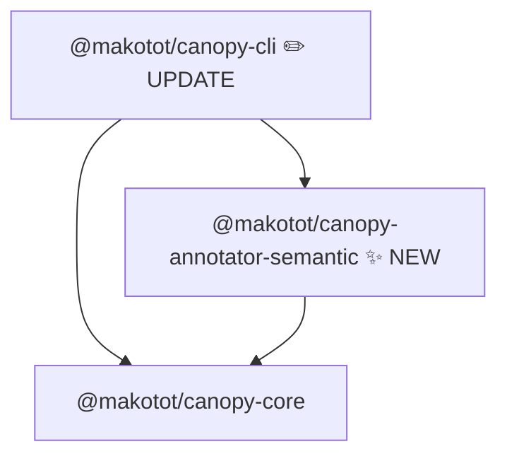

# Design: `@makotot/canopy-annotator-semantic`

- **Date**: 2026-03-19

## Overview

`@makotot/canopy-annotator-semantic` annotates HTML elements in the render tree with their ARIA implicit role as `meta.badge`. The goal is to surface the structure that screen readers and other assistive technologies actually see — i.e., the accessibility tree — directly in the Mermaid flowchart.

The annotator does not judge whether the structure is good or bad. It only surfaces information. The user decides how to interpret it.

---

## Detection Targets

Element names are matched as-is from `TreeNode.component`. No AST analysis is needed.

| Element(s)    | ARIA Implicit Role | Badge                       |
| ------------- | ------------------ | --------------------------- |
| `header`      | `banner`           | `banner`                    |
| `footer`      | `contentinfo`      | `contentinfo`               |
| `main`        | `main`             | `main`                      |
| `nav`         | `navigation`       | `navigation`                |
| `aside`       | `complementary`    | `complementary`             |
| `article`     | `article`          | `article`                   |
| `section`     | `region`           | `region`                    |
| `h1`–`h6`     | `heading`          | `heading lv1`–`heading lv6` |
| `button`      | `button`           | `button`                    |
| `a`           | `link`             | `link`                      |
| `input`       | `textbox`          | `textbox`                   |
| `select`      | `listbox`          | `listbox`                   |
| `textarea`    | `textbox`          | `textbox`                   |
| `form`        | `form`             | `form`                      |
| `div`, `span` | `generic`          | `generic`                   |

Elements outside this list (React components, `p`, `img`, etc.) are not annotated.

---

## Mermaid Output Image

Given:

```tsx
export default function Page() {
  return (
    <div>
      <header>
        <nav>
          <a href="/">Home</a>
        </nav>
      </header>
      <main>
        <h1>Title</h1>
      </main>
      <footer>Footer</footer>
    </div>
  );
}
```

Expected Mermaid output:

```
flowchart TD
  n0["Page"]
  n1["div [generic]"]
  n2["header [banner]"]
  n3["nav [navigation]"]
  n4["a [link]"]
  n5["main [main]"]
  n6["h1 [heading lv1]"]
  n7["footer [contentinfo]"]
  n0 --> n1
  n1 --> n2
  n2 --> n3
  n3 --> n4
  n1 --> n5
  n5 --> n6
  n1 --> n7
  style n1 fill:#f3f4f6,stroke:#d1d5db
  style n2 fill:#dcfce7,stroke:#86efac
  style n3 fill:#dcfce7,stroke:#86efac
  style n4 fill:#dcfce7,stroke:#86efac
  style n5 fill:#dcfce7,stroke:#86efac
  style n6 fill:#dcfce7,stroke:#86efac
  style n7 fill:#dcfce7,stroke:#86efac
```

Key rendering behaviors:

- The node label already contains the element name (e.g. `div`). The badge appends the ARIA role.
- Two colors only: green for role-bearing elements, gray for `div`/`span` (`generic`).
- React component nodes (`Page`) are not annotated and have no badge or style.

---

## Module Structure



| Package              | Change                                                           |
| -------------------- | ---------------------------------------------------------------- |
| `annotator-semantic` | **New** — writes `meta.badge` and `meta.style` for HTML elements |
| `cli`                | **Update** — register `semantic` in the annotator registry       |

No changes to `reporter-mermaid`. It already reads `meta.badge` and `meta.style`.

---

## Public API

```ts
export function createSemanticAnnotator(): Annotator<TreeNode>;
```

No parameters required. Detection is purely name-based.

---

## Meta Schema

```ts
// set only when the element is in the detection list
meta: {
  badge: string; // ARIA role name, e.g. 'banner', 'heading lv1', 'generic'
  style: {
    fill: string;
    stroke: string;
  }
}
```

### Style assignment

| Group    | Elements                                                                                                                          | Fill      | Stroke    |
| -------- | --------------------------------------------------------------------------------------------------------------------------------- | --------- | --------- |
| Semantic | `header`, `footer`, `main`, `nav`, `aside`, `article`, `section`, `h1`–`h6`, `button`, `a`, `input`, `select`, `textarea`, `form` | `#dcfce7` | `#86efac` |
| Generic  | `div`, `span`                                                                                                                     | `#f3f4f6` | `#d1d5db` |

Fields are absent when the element is not in the detection list (sparse meta, consistent with other annotators).

---

## Algorithm

1. Walk the `TreeNode` tree recursively (children + props slots).
2. Look up `node.component` in a static map of `element → { badge, style }`.
3. If found, merge `{ badge, style }` into `node.meta` (spread, preserving existing fields).
4. Return the annotated node; unmatched nodes are returned unchanged.

No AST analysis, no file I/O, no external dependencies beyond `@makotot/canopy-core`.

---

## CLI Integration

```sh
canopy src/app/page.tsx --annotator semantic
canopy src/app/page.tsx --annotator async --annotator semantic
```

CLI annotator registry addition:

```ts
// packages/cli/src/annotators.ts
import { createSemanticAnnotator } from '@makotot/canopy-annotator-semantic';

'semantic': () => createSemanticAnnotator(),
```

---

## Fixture File Plan

| File                      | Purpose                                                          |
| ------------------------- | ---------------------------------------------------------------- |
| `page-with-landmarks.tsx` | `header`, `nav`, `a`, `main`, `article`, `h1`, `aside`, `footer` |
| `page-with-headings.tsx`  | `h1`–`h3` inside `main` and `section`                            |
| `page-with-generic.tsx`   | `div`, `span`, `button`, `form`, `input`, `select`, `textarea`   |

---

## Test Case Plan

- Each landmark element (`header`, `footer`, `main`, `nav`, `aside`) → badge = ARIA role name
- `article` → `article`, `section` → `region`
- `h1` → `heading lv1`, `h2` → `heading lv2`, `h3` → `heading lv3`
- `div`, `span` → `generic`
- `button` → `button`, `a` → `link`, `input` → `textbox`, `select` → `listbox`, `textarea` → `textbox`, `form` → `form`
- React component node (`Page`) → no badge
- Landmark elements → green style; `div` → gray style

---

## Open Questions

1. **`section` role** — `section` only maps to `region` when it has an accessible name. Without static analysis of `aria-label`/`aria-labelledby`, we always annotate it as `region`. This is an approximation. Acceptable for v0.1.
2. **`input` role** — varies by `type` attribute (checkbox, radio, etc.). We always annotate as `textbox`. Acceptable for v0.1.
3. **`a` without `href`** — technically maps to no role. Static analysis cannot reliably detect `href` presence. We always annotate as `link`. Acceptable for v0.1.
