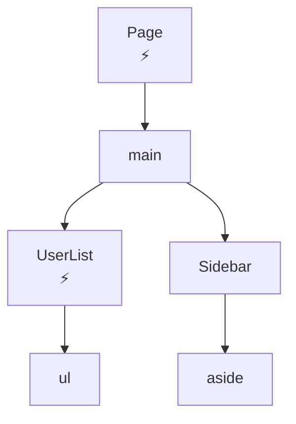
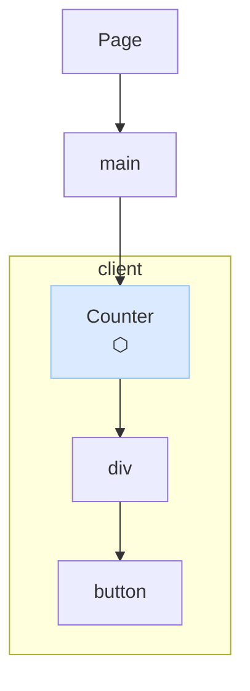
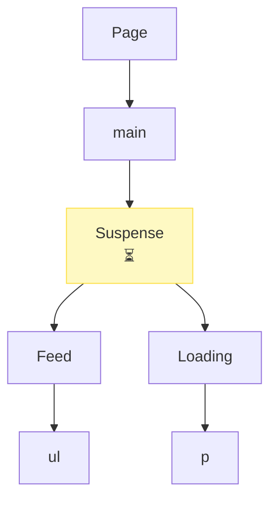
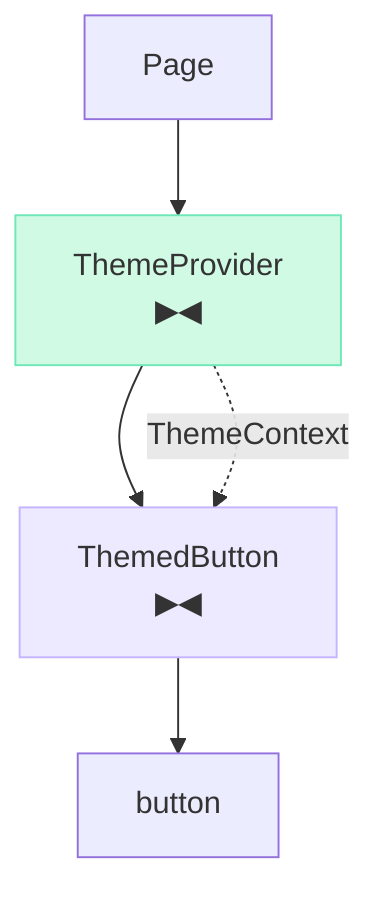
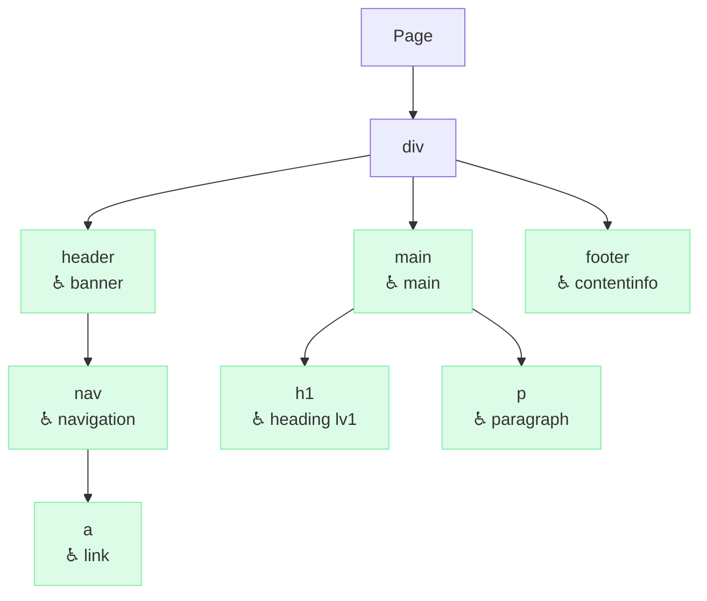
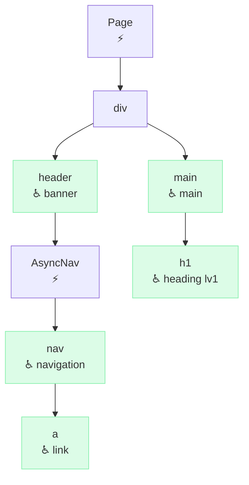

# Design: Badge Visualization Enhancement

- **Date**: 2026-03-20

## Overview

`meta.badge` currently renders as `ComponentName [badge]` — a plain text suffix in brackets. This is hard to parse visually, especially when multiple annotators are active on the same node. This document defines a new rendering convention that replaces text badges with icon-based labels using `<br/>` line breaks.

---

## Problem

The current format appends the badge as bracketed text on the same line:

```
AsyncComponent [async]
ClientComponent [client]
```

When multiple annotators fire on the same node, it becomes a long single line:

```
AsyncClientComponent [async] [client]
```

There is no visual hierarchy. All annotations look the same regardless of their meaning.

---

## Solution

Use a per-annotator icon as the visual marker. Each annotation occupies its own line below the component name, separated by `<br/>`. The icon alone is sufficient for type-indicator annotators (async, client, suspense, context); the semantic annotator appends the ARIA role name because the role name itself is the information.

### Icon Assignment

| Annotator                   | Icon | Label format | Notes                                    |
| --------------------------- | ---- | ------------ | ---------------------------------------- |
| `annotator-async`           | ⚡   | `⚡`         | Icon alone is sufficient                 |
| `annotator-client-boundary` | ⬡    | `⬡`          | Icon alone is sufficient                 |
| `annotator-suspense`        | ⏳   | `⏳`         | Icon alone is sufficient                 |
| `annotator-context`         | ▶◀   | `▶◀`         | Icon alone is sufficient                 |
| `annotator-semantic`        | ♿   | `♿ <role>`  | Icon + role name (role name is the info) |

### Icon Candidates (under review)

Emoji vs Unicode symbol: emoji rendering varies across Mermaid renderers and
fonts. Unicode symbols (single-codepoint) are more consistent. Both columns are
listed for comparison.

#### `annotator-async`

⚡ implies "fast / electricity", which conflicts with the actual semantics of
async ("waiting for I/O"). Candidates:

| Icon | Type    | Rationale                                      |
| ---- | ------- | ---------------------------------------------- |
| ⚡   | emoji   | **current** — widely recognized but misleading |
| 🔄   | emoji   | "in progress / rotating" — I/O cycle           |
| ⏸    | emoji   | "paused / suspended execution"                 |
| ⚙    | emoji   | "background processing"                        |
| ↻    | Unicode | single-codepoint loop arrow                    |

#### `annotator-client-boundary`

⬡ (white hexagon) has no inherent "client / browser" meaning. Candidates:

| Icon | Type    | Rationale                                      |
| ---- | ------- | ---------------------------------------------- |
| ⬡    | Unicode | **current** — neutral, no clear association    |
| 🖥   | emoji   | "runs in the browser / client device"          |
| ◈    | Unicode | diamond with dot — "interactive / client-side" |
| ⬢    | Unicode | filled hexagon — stronger presence than ⬡      |

#### `annotator-suspense`

⏳ is intuitive for "waiting". No strong reason to change. Candidates for
reference:

| Icon | Type    | Rationale                               |
| ---- | ------- | --------------------------------------- |
| ⏳   | emoji   | **current** — "loading / wait"          |
| 🕐   | emoji   | clock — "waiting for time"              |
| ◌    | Unicode | dotted circle — "pending / empty state" |

#### `annotator-context`

▶◀ is two codepoints and reads as "arrows closing in", which only loosely
suggests "shared value flowing out". Candidates:

| Icon | Type    | Rationale                                    |
| ---- | ------- | -------------------------------------------- |
| ▶◀   | Unicode | **current** — two codepoints, "converging"   |
| ⊕    | Unicode | circled plus — "shared / injected value"     |
| ◎    | Unicode | bullseye — "central value radiating outward" |
| ⬭    | Unicode | white ellipse — neutral container            |

#### `annotator-semantic`

♿ is the established accessibility symbol (WCAG / WAI-ARIA). No strong
alternative. Retain as-is unless a more specific ARIA icon emerges.

---

## Label Format

### Single annotator

```
ComponentName<br/>⚡
```

```
header<br/>♿ banner
```

### Multiple annotators

Each annotation on its own line:

```
ComponentName<br/>⚡<br/>⏳
```

```
AsyncComponent<br/>⚡<br/>♿ banner
```

### No annotation

Nodes not targeted by any active annotator retain their original label with no `<br/>`:

```
ComponentName
```

For `annotator-semantic`, `generic`, `presentation`, and `none` are treated as no annotation — no icon, no line break.

---

## Mermaid Output Examples

### async only

Input:

```tsx
export default async function Page() {
  return (
    <main>
      <UserList />
      <Sidebar />
    </main>
  );
}

async function UserList() {
  return <ul />;
}

function Sidebar() {
  return <aside />;
}
```

Output:



---

### client-boundary only

Input:

```tsx
'use client';
export function Counter() {
  return (
    <div>
      <button>+</button>
    </div>
  );
}

export default function Page() {
  return (
    <main>
      <Counter />
    </main>
  );
}
```

Output:



---

### suspense only

Input:

```tsx
import { Suspense } from 'react';

export default function Page() {
  return (
    <main>
      <Suspense fallback={<Loading />}>
        <Feed />
      </Suspense>
    </main>
  );
}

function Feed() {
  return <ul />;
}

function Loading() {
  return <p />;
}
```

Output:



---

### context only

Input:

```tsx
import { createContext, useContext } from 'react';

const ThemeContext = createContext('light');

export function ThemeProvider({ children }: { children: React.ReactNode }) {
  return <ThemeContext.Provider value="dark">{children}</ThemeContext.Provider>;
}

export function ThemedButton() {
  const theme = useContext(ThemeContext);
  return <button>{theme}</button>;
}

export default function Page() {
  return (
    <ThemeProvider>
      <ThemedButton />
    </ThemeProvider>
  );
}
```

Output:



---

### semantic only

Input:

```tsx
export default function Page() {
  return (
    <div>
      <header>
        <nav>
          <a href="/">Home</a>
        </nav>
      </header>
      <main>
        <h1>Title</h1>
        <p>Body text.</p>
      </main>
      <footer>Footer</footer>
    </div>
  );
}
```

Output:



---

### async + semantic (multiple annotators on one node)

Input:

```tsx
export default async function Page() {
  return (
    <div>
      <header>
        <AsyncNav />
      </header>
      <main>
        <h1>Title</h1>
      </main>
    </div>
  );
}

async function AsyncNav() {
  return (
    <nav>
      <a href="/">Home</a>
    </nav>
  );
}
```

Output:



---

## Output Format and Consumers

Mermaid output is designed for **human consumption** — rendered as a diagram in a browser or Markdown preview.

When feeding canopy output to an **AI agent**, use `@makotot/canopy-reporter-json` instead. Mermaid text requires the agent to re-derive the tree structure from opaque IDs (`n0`, `n1`, …) and edge lines, which increases parsing cost and error risk. The JSON reporter preserves the component tree as-is:

```json
{
  "component": "Page",
  "meta": { "async": true },
  "children": [
    {
      "component": "UserList",
      "meta": { "async": true },
      "children": []
    }
  ]
}
```

| Consumer              | Recommended reporter |
| --------------------- | -------------------- |
| Human (visual review) | `reporter-mermaid`   |
| AI agent              | `reporter-json`      |
| CI diff / snapshot    | Either               |

---

## Changes Required

### `reporter-mermaid`

- Change node label construction to join annotations with `<br/>` instead of appending `[badge]`.
- `meta.badge` values are now rendered as `icon text` lines, not `[text]` suffixes.
- The reporter does not know about individual annotators — it reads `meta.badge` as-is and places it on a new line.

### Annotators

Each annotator writes `meta.badge` with the icon already included:

```ts
// annotator-async
meta.badge = '⚡';

// annotator-client-boundary
meta.badge = '⬡';

// annotator-suspense
meta.badge = '⏳';

// annotator-context (provider)
meta.badge = '▶◀';

// annotator-semantic
meta.badge = '♿ banner'; // icon + role name
// no badge for generic/presentation/none
```

### `meta-render-convention`

Update the `meta.badge` rendering definition:

- **Old**: `ComponentName [badge]`
- **New**: `ComponentName<br/>badge` (icon string placed on a new line)

When multiple annotators set `meta.badge`, the reporter concatenates them with `<br/>` in the order annotators were applied.

---

## Multi-Badge Aggregation

`meta.badge` is currently a single `string`. When multiple annotators are active, the reporter must aggregate all badge values.

Two options:

1. **Change `meta.badge` to `string[]`** — each annotator pushes its icon string; reporter joins with `<br/>`.
2. **Keep `meta.badge` as `string`, concatenate with `<br/>` at write time** — each annotator appends `\n<br/>icon` to the existing value.

**Decision**: Change `meta.badge` to `string[]`. This is cleaner, avoids string-manipulation bugs, and makes the reporter's join logic explicit. This is a breaking change to `meta-render-convention` and all annotators.

```ts
// TreeNode.meta
badge?: string[];  // was: badge?: string
```

```ts
// reporter-mermaid label construction
const badgeLines = node.meta?.badge ?? [];
const label =
  badgeLines.length > 0 ? `${node.component}<br/>${badgeLines.join('<br/>')}` : node.component;
```

---

## Packages Affected

| Package                                     | Change                                                                |
| ------------------------------------------- | --------------------------------------------------------------------- |
| `@makotot/canopy-core`                      | `meta.badge` type: `string` → `string[]`                              |
| `@makotot/canopy-reporter-mermaid`          | Label construction: join badge array with `<br/>`                     |
| `@makotot/canopy-annotator-async`           | Write `['⚡']` instead of `'async'`                                   |
| `@makotot/canopy-annotator-client-boundary` | Write `['⬡']` instead of `'client'`                                   |
| `@makotot/canopy-annotator-suspense`        | Write `['⏳']` instead of `'suspense'`                                |
| `@makotot/canopy-annotator-context`         | Write `['▶◀']` instead of `'context'` / `'consumer'`                  |
| `@makotot/canopy-annotator-semantic`        | Write `['♿ <role>']`; skip badge for `generic`/`presentation`/`none` |
