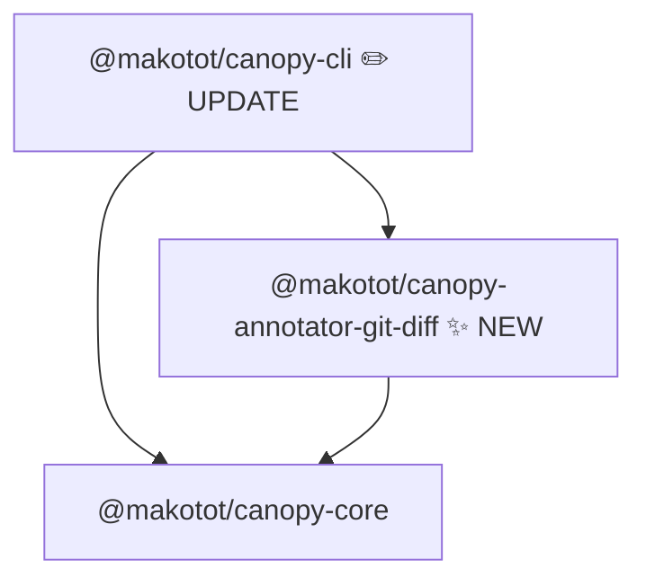

# Design: `@makotot/canopy-annotator-git-diff`

- **Date**: 2026-03-21

## Overview

`@makotot/canopy-annotator-git-diff` marks `TreeNode` instances whose resolved component source file appears in a provided list of changed files (e.g. the output of `git diff --name-only`).

This makes it immediately obvious which components in a render tree are affected by a given set of changes — useful for PR reviews, debugging, and impact analysis.

The annotator itself is pure: it receives `changedFiles: string[]` as an argument and performs no I/O. The CLI reads `changedFiles` from stdin, allowing the user to pipe any `git diff` invocation directly.

---

## Constraint: Deleted Components

Deleted components cannot be annotated. Canopy builds the render tree from the current state of the source files. A component whose file has been deleted no longer exists in the tree, so there is no node to annotate.

**Annotatable change types:**

| Git status   | Annotatable        | Note                           |
| ------------ | ------------------ | ------------------------------ |
| Added (A)    | ✅                 | Component exists in the tree   |
| Modified (M) | ✅                 | Component exists in the tree   |
| Renamed (R)  | ✅ (new name only) | Old name no longer exists      |
| Deleted (D)  | ❌                 | Component absent from the tree |

This is a known design constraint, not a bug. Package documentation must state it explicitly.

---

## Mermaid Output Image

Given this component tree:

```tsx
// page.tsx
import { ChangedWidget } from './changed-widget'; // in git diff
import { UnchangedWidget } from './unchanged-widget'; // not in diff

export default function Page() {
  return (
    <main>
      <ChangedWidget />
      <UnchangedWidget />
    </main>
  );
}
```

Expected Mermaid output:

```
flowchart TD
  n0["Page"]
  n1["main"]
  n2["ChangedWidget<br/>⎇"]
  n3["UnchangedWidget"]
  n0 --> n1
  n1 --> n2
  n1 --> n3
  style n2 fill:#fef3c7,stroke:#f59e0b
```

Key rendering behaviors:

- Components whose source file is in `changedFiles` receive a `⎇` badge and amber styling (`fill:#fef3c7,stroke:#f59e0b`).
- Components not in `changedFiles` are rendered without any badge or color.
- HTML intrinsic elements (`main`, `div`, etc.) are never annotated.

---

## Module Structure



Packages affected:

| Package              | Change                                                                                                                  |
| -------------------- | ----------------------------------------------------------------------------------------------------------------------- |
| `annotator-git-diff` | **New** — traverses tree, compares resolved source paths against `changedFiles`, sets `meta.badge` and `meta.style`     |
| `cli`                | **Update** — register `git-diff` annotator; read changed file paths from stdin when `--annotator git-diff` is specified |

---

## CLI Integration

The annotator is opt-in via `--annotator git-diff`. When selected, the CLI reads newline-separated file paths from **stdin**. This lets users pipe any `git diff` invocation directly — no canopy-specific flags needed.

```sh
# Changes since last commit
git diff --name-only HEAD | canopy src/app/page.tsx --annotator git-diff

# Changes relative to a base branch (PR review)
git diff --name-only main | canopy src/app/page.tsx --annotator git-diff

# Staged changes only
git diff --name-only --staged | canopy src/app/page.tsx --annotator git-diff

# Combined with other annotators
git diff --name-only main | canopy src/app/page.tsx --annotator git-diff --annotator async
```

No new CLI options are added. The `--annotator` flag remains the only entry point.

### `cli.ts` change (action handler only, no new options)

The existing `--annotator` option is sufficient. No new flags are added. Only the action handler changes to read stdin and pass `changedFiles` to `run`.

`git-diff` requires external state (`changedFiles`) that other annotators do not. Therefore it is **not** registered in `ANNOTATORS` and is handled explicitly in `run.ts`. This is the necessary exception to the registry pattern.

Because `git diff --name-only` outputs paths relative to the **git repository root** (not `cwd`), the CLI resolves the repo root via `git rev-parse --show-toplevel` and converts each path to absolute. This ensures correct matching regardless of which directory `canopy` is invoked from, including monorepos. The `git rev-parse` call runs **only** when `--annotator git-diff` is present.

If `--annotator git-diff` is specified but stdin is a TTY (no pipe), the CLI emits a warning to stderr and proceeds with `changedFiles: []` — no components will be annotated.

```ts
// cli.ts action handler
const annotatorNames = options.annotator ?? [];
let changedFiles: string[] = [];

if (annotatorNames.includes('git-diff')) {
  if (process.stdin.isTTY) {
    process.stderr.write(
      'warning: --annotator git-diff requires piped input, e.g.: git diff --name-only HEAD | canopy ...\n',
    );
  } else {
    const repoRoot = execSync('git rev-parse --show-toplevel').toString().trim();
    changedFiles = fs
      .readFileSync('/dev/stdin', 'utf8')
      .split('\n')
      .filter(Boolean)
      .map((f) => path.resolve(repoRoot, f));
  }
}

run(file, console.log, undefined, options.component, annotatorNames, changedFiles);
```

### `run.ts` change

`git-diff` is handled outside the `ANNOTATORS` registry because its factory requires `changedFiles`, which is external data unavailable at registry definition time. The `changedFiles` parameter conveys this data; it is only used when `'git-diff'` appears in `annotatorNames`.

```ts
export function run(
  filePath: string,
  out: Out,
  project?: Project,
  componentName?: string,
  annotatorNames: string[] = [],
  changedFiles: string[] = [],
): void {
  for (const name of annotatorNames) {
    if (name !== 'git-diff' && !(name in ANNOTATORS)) {
      throw new Error(`Unknown annotator: ${name}`);
    }
  }
  const { tree, project: resolvedProject, sourceFilePath } = analyzeRenderTree({ ... });

  const annotators = annotatorNames.map((name) => {
    if (name === 'git-diff') {
      return createGitDiffAnnotator(changedFiles)(sourceFilePath, resolvedProject);
    }
    return ANNOTATORS[name]!(sourceFilePath, resolvedProject);
  });

  createPipeline({ build: () => tree, annotators, reporter: createMermaidReporter(out) });
}
```

---

## Public API

```ts
export function createGitDiffAnnotator(
  changedFiles: string[],
): (sourceFilePath: string, project: Project) => Annotator<TreeNode>;
```

- `changedFiles` — list of **absolute** file paths that appear in the diff. Path normalization (repo-root resolution) is the caller's responsibility; the annotator stores these as-is in a `Set` for O(1) lookup.
- The returned function matches the standard annotator factory signature `(sourceFilePath, project) => Annotator<TreeNode>`, consistent with other annotators.
- `sourceFilePath` — absolute path to the entry file. Used as the base for `resolveComponent`.
- `project` — the shared ts-morph `Project` instance. Used to resolve each component's source file path.

---

## Meta Schema

```ts
meta: {
  badge: '⎇';
  style: {
    fill: '#fef3c7';
    stroke: '#f59e0b';
  }
  tags: ['git-changed'];
}
```

Fields are absent when the component's source file is not in `changedFiles` (sparse meta convention, consistent with other annotators).

`meta.tags` is the shared annotator-specific field for programmatic consumers (written via `appendTag` from `@makotot/canopy-core`). `meta.badge` and `meta.style` are the render convention fields read by `reporter-mermaid`.

---

## Algorithm

### Setup (inside factory closure)

1. Receive `changedFiles: string[]` (already absolute paths, normalized by the CLI).
2. Store as `changedSet: Set<string>` for O(1) lookup.

### Tree Walk

For each `TreeNode`:

1. If `node.component` starts with a lowercase letter, skip (HTML intrinsic element).
2. Call `resolveComponent(node.component, sourceFilePath, project)`.
3. If resolution fails (external / unresolvable component), skip without error.
4. Get the absolute source file path via `fn.getSourceFile().getFilePath()`.
5. If that path is in `changedSet`, merge onto the node:
   ```ts
   meta: {
     ...node.meta,
     ...appendBadge(node.meta, '⎇'),
     ...appendTag(node.meta, 'git-changed'),
     style: { fill: '#fef3c7', stroke: '#f59e0b' },
   }
   ```
6. Recurse into `node.children` and each value in `node.props`.

`changedSet` is built once inside the factory closure and reused across the recursive walk — not recomputed per node.

---

## Fixture File Plan

All fixtures live under `src/__fixtures__/`.

| File                                  | Purpose                                                                                                       |
| ------------------------------------- | ------------------------------------------------------------------------------------------------------------- |
| `page-with-changed-and-unchanged.tsx` | Entry; renders `ChangedWidget` and `UnchangedWidget` side-by-side. Primary fixture.                           |
| `changed-widget.tsx`                  | Represents a component whose file appears in `changedFiles`.                                                  |
| `unchanged-widget.tsx`                | Represents a component whose file does not appear in `changedFiles`.                                          |
| `page-with-nested-changed.tsx`        | Entry; tests that annotation propagates correctly when a changed component is nested inside an unchanged one. |

---

## Test Case Plan

`changedFiles` must be absolute paths (matching the Public API contract). Tests resolve fixture paths via `import.meta.url`, consistent with other annotator test suites.

```ts
const fixture = (name: string) =>
  new URL(`../__fixtures__/${name}`, import.meta.url).pathname;

it.each([
  {
    label: 'marks component whose source file is in changedFiles',
    fixture: 'page-with-changed-and-unchanged',
    changedFiles: () => [fixture('changed-widget.tsx')],
    get: (tree) => findNode(tree, 'ChangedWidget')?.meta?.tags?.includes('git-changed'),
    expected: true,
  },
  {
    label: 'sets ⎇ badge on changed component',
    fixture: 'page-with-changed-and-unchanged',
    changedFiles: () => [fixture('changed-widget.tsx')],
    get: (tree) => findNode(tree, 'ChangedWidget')?.meta?.badge,
    expected: '⎇',
  },
  {
    label: 'sets amber style on changed component',
    fixture: 'page-with-changed-and-unchanged',
    changedFiles: () => [fixture('changed-widget.tsx')],
    get: (tree) => findNode(tree, 'ChangedWidget')?.meta?.style,
    expected: { fill: '#fef3c7', stroke: '#f59e0b' },
  },
  {
    label: 'does not mark component not in changedFiles',
    fixture: 'page-with-changed-and-unchanged',
    changedFiles: () => [fixture('changed-widget.tsx')],
    get: (tree) => findNode(tree, 'UnchangedWidget')?.meta?.tags?.includes('git-changed'),
    expected: undefined,
  },
  {
    label: 'does not mark HTML intrinsic elements',
    fixture: 'page-with-changed-and-unchanged',
    changedFiles: () => [fixture('changed-widget.tsx')],
    get: (tree) => findNode(tree, 'main')?.meta?.tags?.includes('git-changed'),
    expected: undefined,
  },
  {
    label: 'marks nested changed component',
    fixture: 'page-with-nested-changed',
    changedFiles: () => [fixture('changed-widget.tsx')],
    get: (tree) => findNode(tree, 'ChangedWidget')?.meta?.tags?.includes('git-changed'),
    expected: true,
  },
  {
    label: 'marks entry file component when entry file itself is changed',
    fixture: 'page-with-changed-and-unchanged',
    changedFiles: () => [fixture('page-with-changed-and-unchanged.tsx')],
    get: (tree) => findNode(tree, 'Page')?.meta?.tags?.includes('git-changed'),
    expected: true,
  },
  {
    label: 'does not annotate when changedFiles is empty',
    fixture: 'page-with-changed-and-unchanged',
    changedFiles: () => [],
    get: (tree) => findNode(tree, 'ChangedWidget')?.meta?.tags?.includes('git-changed'),
    expected: undefined,
  },
])('$label', ...)
```

---

## File Structure

```
packages/annotator-git-diff/
  src/
    index.ts         # exports createGitDiffAnnotator
    index.test.ts
    __fixtures__/
      page-with-changed-and-unchanged.tsx
      changed-widget.tsx
      unchanged-widget.tsx
      page-with-nested-changed.tsx
  package.json
  tsconfig.json
  tsconfig.build.json
```

`src/index.ts` symbol order:

```
1. export function createGitDiffAnnotator(...)   ← public API
2. function annotateNode(...)                     ← recursive tree walk
3. function buildChangedSet(...)                  ← stores changedFiles as a Set for O(1) lookup
```

---
