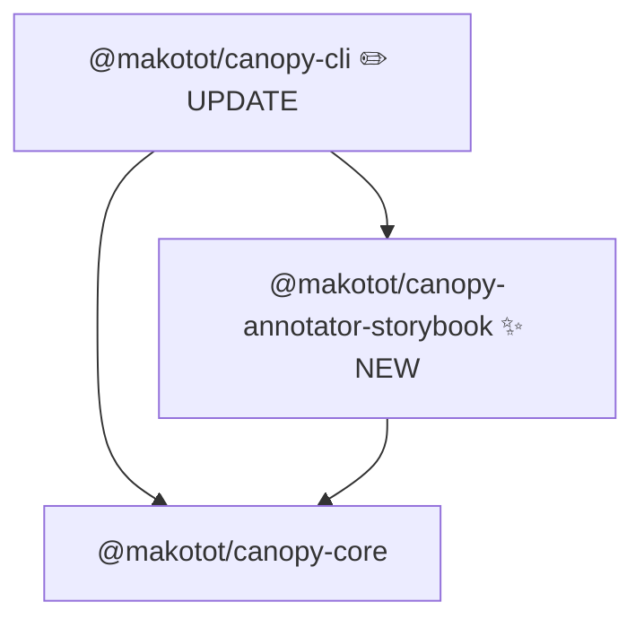

# Design: `@makotot/canopy-annotator-storybook`

- **Date**: 2026-03-22

## Overview

`@makotot/canopy-annotator-storybook` marks `TreeNode` instances whose resolved component is referenced by a Storybook CSF3 `meta.component` field in any source file of the project.

Detection is based entirely on static analysis of the `meta.component` value — not file naming or co-location conventions. A component has a story if and only if some story file's default-exported meta object has a `component` property that resolves to that component's definition.

---

## CSF3 Target Pattern

Only CSF3 is supported. The annotator looks for this exact shape:

```typescript
const meta = {
  component: Button,
} satisfies Meta<typeof Button>;
export default meta;
```

The `component` field directly references the component identifier. ts-morph can resolve that identifier to its import declaration and ultimately to the source file where the component is defined.

---

## Detection Algorithm

### Phase 1: Build the story map (once, at annotator creation)

1. Collect all source files in the `project`.
2. Filter to **story files**: files that contain at least one import declaration whose module specifier starts with `@storybook/`.
3. For each story file:
   a. Get the default export declaration.
   b. If the default export is an identifier (e.g. `export default meta`), resolve it to the referenced variable declaration initializer.
   c. In that object literal, find the property named `component`.
   d. Get the value node of that property (an identifier, e.g. `Button`).
   e. Resolve the identifier via the import declarations of the story file to its source file path using `resolveComponent`-equivalent logic.
   f. Record the absolute resolved file path in `storiedFiles: Set<string>`.
4. Return the `Set` as a closure variable — computed once, reused per node.

### Phase 2: Annotate (per node)

1. If `node.component` starts with a lowercase letter, skip (HTML intrinsic element).
2. Call `resolveComponent(node.component, sourceFilePath, project)`.
3. If resolution fails (unresolvable or external package), skip without error.
4. Call `fn.getSourceFile().getFilePath()` to get the component's absolute source path.
5. If that path is in `storiedFiles`, annotate the node:
   ```ts
   meta: {
     ...node.meta,
     ...appendBadge(node.meta, '◆'),
     ...appendTag(node.meta, 'storybook'),
     style: { fill: '#fce7f3', stroke: '#f9a8d4' },
   }
   ```
6. Recurse into `node.children` and each value in `node.props`.

---

## Mermaid Output Image

Given this component tree:

```tsx
// page.tsx
import { StoriedButton } from './storied-button';
import { UnstoriedWidget } from './unstoried-widget';

export default function Page() {
  return (
    <main>
      <StoriedButton />
      <UnstoriedWidget />
    </main>
  );
}
```

Where `storied-button.stories.ts` (in any location in the project) contains:

```typescript
import { StoriedButton } from './storied-button';

const meta = {
  component: StoriedButton,
} satisfies Meta<typeof StoriedButton>;
export default meta;
```

Expected Mermaid output:

```
flowchart TD
  n0["Page"]
  n1["main"]
  n2["StoriedButton<br/>◆"]
  n3["UnstoriedWidget"]
  n0 --> n1
  n1 --> n2
  n1 --> n3
  style n2 fill:#fce7f3,stroke:#f9a8d4
```

Key rendering behaviors:

- Components referenced in a story's `meta.component` receive a `◆` badge and pink styling (`fill:#fce7f3,stroke:#f9a8d4`).
- Components with no associated story are rendered without any badge or color.
- HTML intrinsic elements (`main`, `div`, etc.) are never annotated.

---

## Module Structure



| Package               | Change                                                                                                 |
| --------------------- | ------------------------------------------------------------------------------------------------------ |
| `annotator-storybook` | **New** — builds `storiedFiles` set at init, walks tree, sets `meta.badge` and `meta.style` per node   |
| `cli`                 | **Update** — register `'storybook': createStorybookAnnotator` in the `ANNOTATORS` registry in `run.ts` |

---

## Public API

```ts
export function createStorybookAnnotator(
  sourceFilePath: string,
  project: Project,
): Annotator<TreeNode>;
```

Standard annotator factory signature, consistent with all other annotators. No extra arguments — the `project` already contains all source files and is sufficient to scan for story files.

---

## Meta Schema

This annotator appends the following fields when a component has a story:

```ts
meta: {
  badge: string;                            // '◆' appended via appendBadge
  style: { fill: string; stroke: string };  // { fill: '#fce7f3', stroke: '#f9a8d4' }
  tags: string[];                           // 'storybook' appended via appendTag
}
```

Fields are absent when the component has no associated story (sparse meta convention, consistent with other annotators).

---

## Edge Cases

| Case                                                                  | Behavior                                                        |
| --------------------------------------------------------------------- | --------------------------------------------------------------- |
| Story file has no `component` field in meta                           | Skipped — `title`-only stories are not sufficient for detection |
| `meta.component` is an external package component                     | `resolveComponent` returns `undefined` → skipped                |
| `meta.component` is an inline function literal                        | Unnamed — cannot resolve to a file path → skipped               |
| `export default meta` where `meta` is not a variable in the same file | Unresolvable → skipped without error                            |
| Multiple story files referencing the same component                   | Idempotent — `Set` deduplicates; node is annotated once         |
| CSF2 (`export default { component: Foo }` without `satisfies`)        | Out of scope — not supported in v0.1                            |
| MDX stories (`.stories.mdx`)                                          | Out of scope — ts-morph cannot parse MDX                        |

---

## Fixture File Plan

All fixtures live under `src/__fixtures__/`.

| File                                  | Purpose                                                           |
| ------------------------------------- | ----------------------------------------------------------------- |
| `page-with-storied-and-unstoried.tsx` | Entry; renders `StoriedButton` and `UnstoriedWidget` side-by-side |
| `storied-button.tsx`                  | Component referenced by a story's `meta.component`                |
| `storied-button.stories.ts`           | CSF3 story file; `meta.component = StoriedButton`                 |
| `unstoried-widget.tsx`                | Component with no associated story                                |
| `page-with-nested-storied.tsx`        | Entry; storied component nested inside an unstoried parent        |

---

## Test Case Plan

```ts
const fixture = (name: string) =>
  new URL(`../__fixtures__/${name}`, import.meta.url).pathname;

it.each([
  {
    label: 'marks component referenced in meta.component',
    fixture: 'page-with-storied-and-unstoried',
    get: (tree) => findNode(tree, 'StoriedButton')?.meta?.tags?.includes('storybook'),
    expected: true,
  },
  {
    label: 'sets ◆ badge on storied component',
    fixture: 'page-with-storied-and-unstoried',
    get: (tree) => findNode(tree, 'StoriedButton')?.meta?.badge,
    expected: '◆',
  },
  {
    label: 'sets pink style on storied component',
    fixture: 'page-with-storied-and-unstoried',
    get: (tree) => findNode(tree, 'StoriedButton')?.meta?.style,
    expected: { fill: '#fce7f3', stroke: '#f9a8d4' },
  },
  {
    label: 'does not mark component absent from any meta.component',
    fixture: 'page-with-storied-and-unstoried',
    get: (tree) => findNode(tree, 'UnstoriedWidget')?.meta?.tags?.includes('storybook'),
    expected: undefined,
  },
  {
    label: 'does not mark HTML intrinsic elements',
    fixture: 'page-with-storied-and-unstoried',
    get: (tree) => findNode(tree, 'main')?.meta?.tags?.includes('storybook'),
    expected: undefined,
  },
  {
    label: 'marks nested storied component',
    fixture: 'page-with-nested-storied',
    get: (tree) => findNode(tree, 'StoriedButton')?.meta?.tags?.includes('storybook'),
    expected: true,
  },
])('$label', ...)
```

---

## File Structure

```
packages/annotator-storybook/
  src/
    index.ts         # exports createStorybookAnnotator
    index.test.ts
    __fixtures__/
      page-with-storied-and-unstoried.tsx
      storied-button.tsx
      storied-button.stories.ts
      unstoried-widget.tsx
      page-with-nested-storied.tsx
  package.json
  tsconfig.json
  tsconfig.build.json
```

`src/index.ts` symbol order:

```
1. export function createStorybookAnnotator(...)   ← public API
2. function buildStoriedFiles(...)                 ← Phase 1: scan project for story files
3. function resolveMetaComponent(...)              ← extract component path from a story file
4. function annotateNode(...)                      ← Phase 2: recursive tree walk
```
